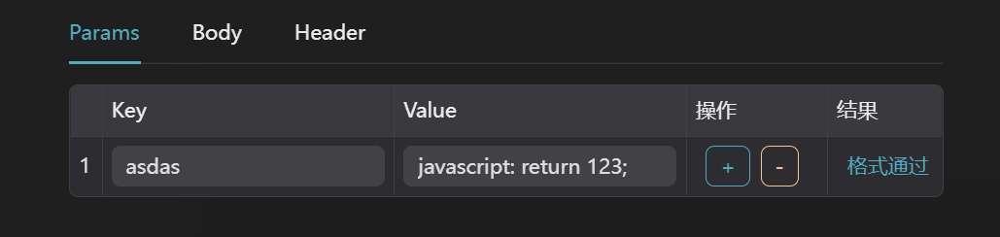

# 常见问题

### 创建矩形

本工具中没有专门的矩形，但是可以直接使用 `文字` 图表来进行矩形的创建。

- 将文本清空，X/Y 轴的内边距就是矩形的宽与高
- 背景就是矩形的颜色
- 圆角也是同理

### 预览模糊

- 屏幕的比例和定义的比例不一致的同时开启了滤镜功能
- 若展示的比例一致，开启滤镜则不会模糊
- 若需要使用滤镜功能，并且屏幕不固定，建议使用Y轴/X轴滚动的适配方式

### 历史记录

历史记录不支持所有操作，当前支持数量有限，使用的时候需要注意，请不要无脑 `Ctrl + Z`。

若想了解当前步骤已经存储的内容，请在工作台底部左侧的 `历史记录` 里进行查看，最多只保留 100 条记录。

### 请求动态获取值

请求配置里的 value 支持 js 语句分析:



```javascript
// 例子1
javascript：return 1;

// 例子2
javascript：let a=1; return a;

// 例子3
javascript：return new URLSearchParams(location.search).get('token');
```

> 注意符合 js 语句格式, 只识别英文字符!
