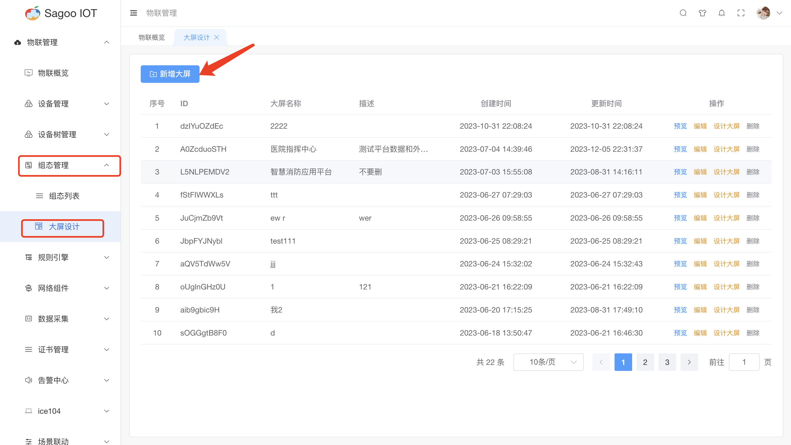
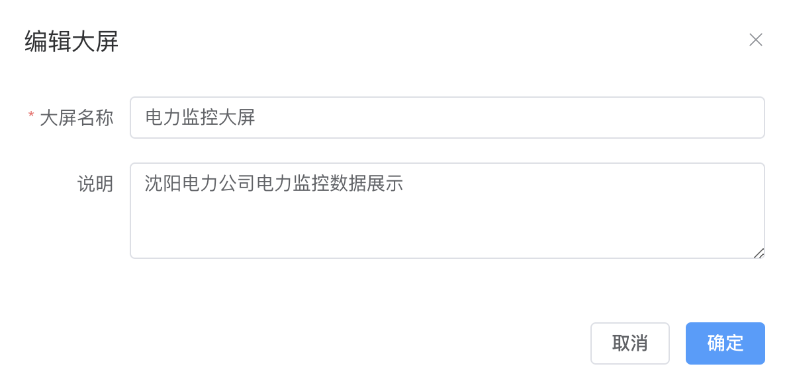
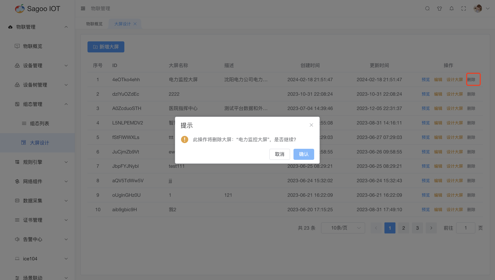

# 大屏编辑

## 大屏设计说明

大屏设计是指为大型显示屏或显示墙设计的用户界面和图形化布局。这种设计通常用于控制中心、监控室、信息发布、数据可视化等场景，旨在通过可视化的方式展示重要的信息、数据和图表，以便用户快速了解和分析信息。

## 创建大屏

1. 请确保已登录SagooIOT物联网平台。

2. 在左侧导航栏中，选择物联管理->组态管理->大屏设计

3. 创建大屏
* 点击“新增大屏”按钮。
  
* 在弹出的对话框中，输入必填项。
  
* 确定后，系统将创建并显示新的大屏。

## 设计大屏

* 设计大屏图主要是对大屏进行基础设计及数据信息绑定等。
* 设计大屏图请参考[设计大屏](design-a-large-screen.md)

## 修改大屏信息

* 如果需要编辑大屏的名称或其他信息，可以在大屏列表项点击“编辑”按钮进行修改。
  

## 删除大屏信息

* 如果需要删除大屏的信息，可以在大屏列表项点击“删除”按钮进行删除。
  

