# 权限配置

## 菜单管理

在系统配置-菜单管理添加对应菜单

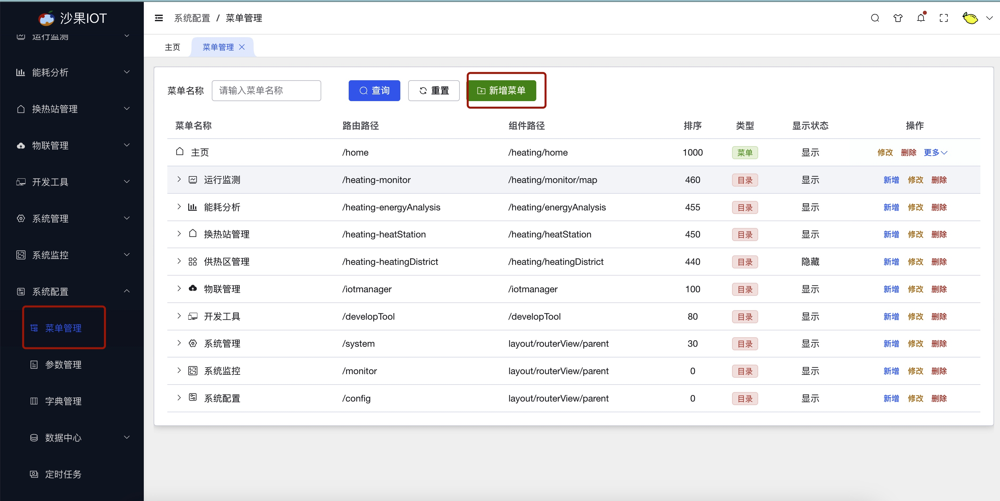

## 按钮管理

在添加完菜单之后，添加对应的按钮权限
添加按钮权限的时候，按钮编码需要与前端开发相对应

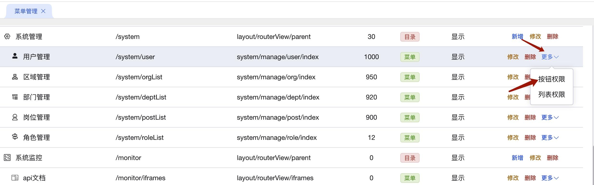

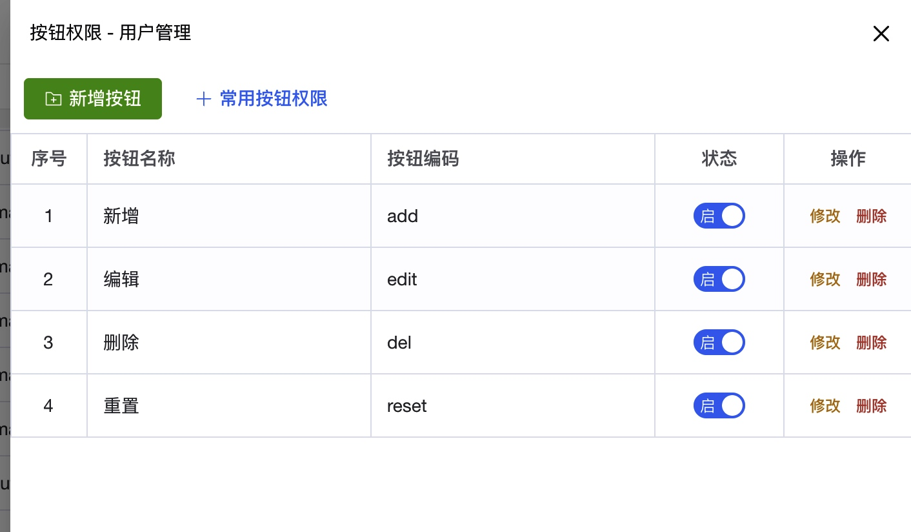

## 列表管理
在添加完菜单之后，添加对应的列表权限
添加列表权限的时候，列表编码需要与前端开发相对应

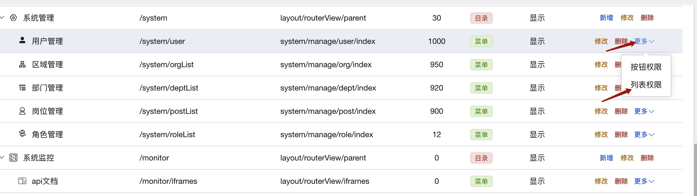

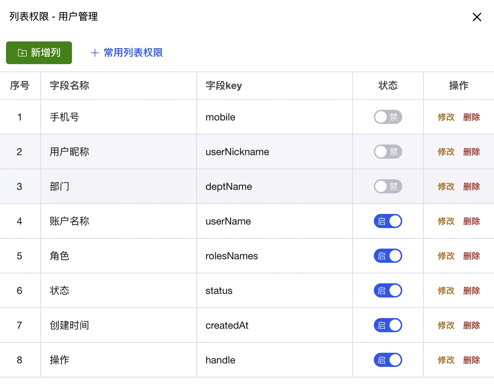

## 接口管理

在系统配置-接口管理新增接口信息

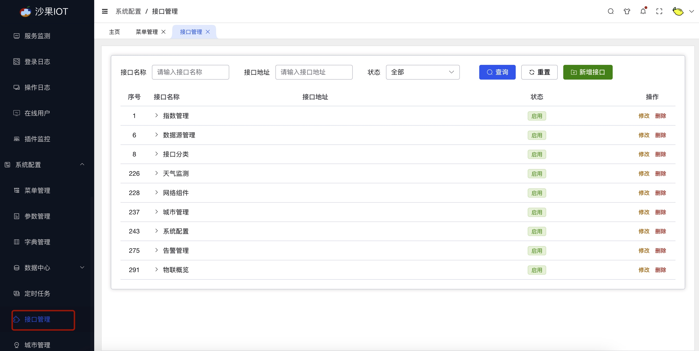

添加接口时，可配置对应的关联页面，用于菜单访问权限配置

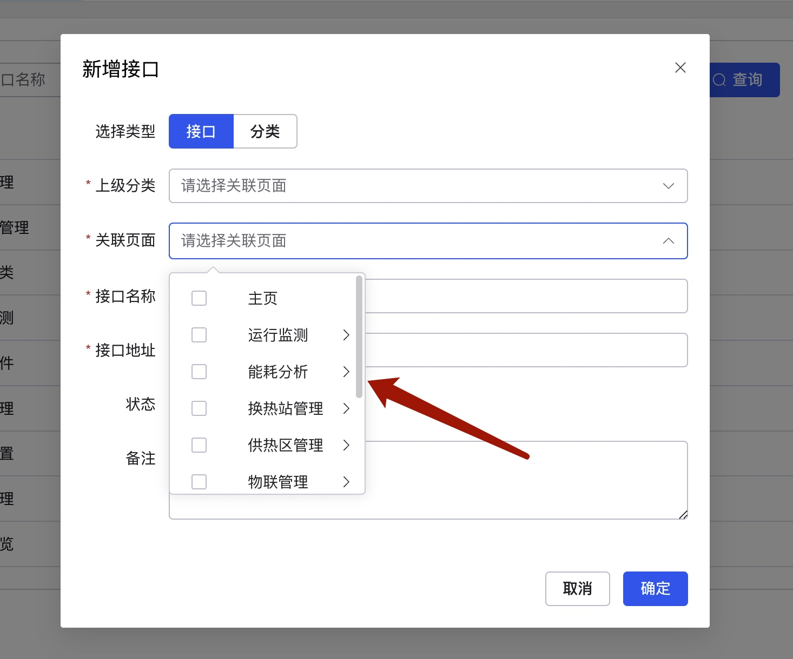

## 角色管理

1. 系统管理-角色管理新增角色

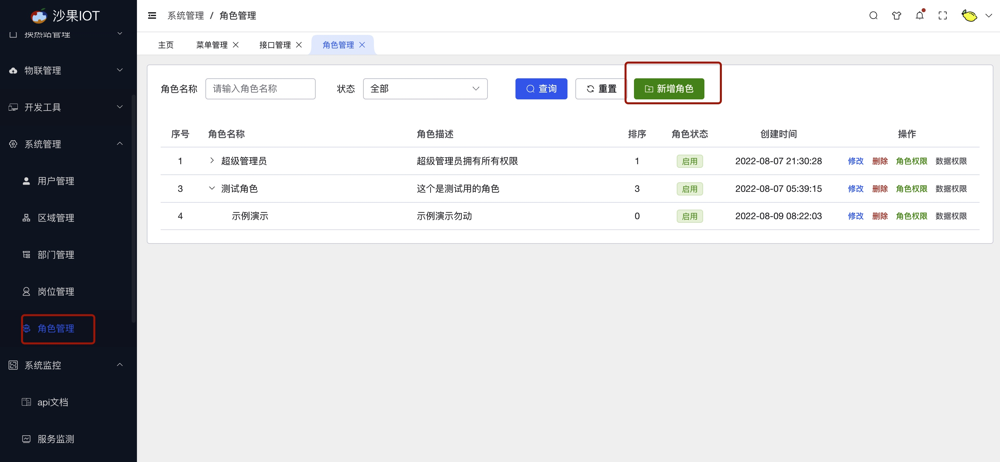

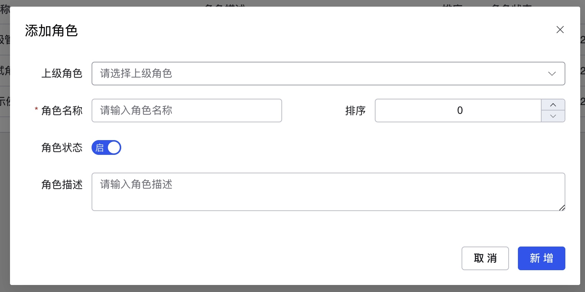

2. 角色权限配置

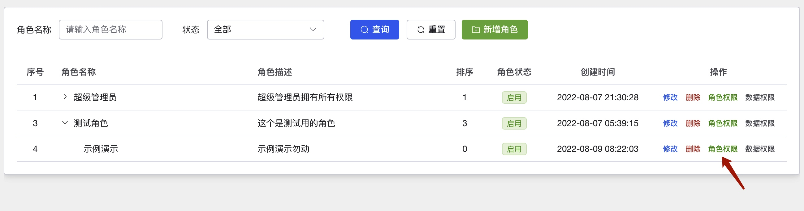

    1.  选择授权菜单，点击下一步授权按钮

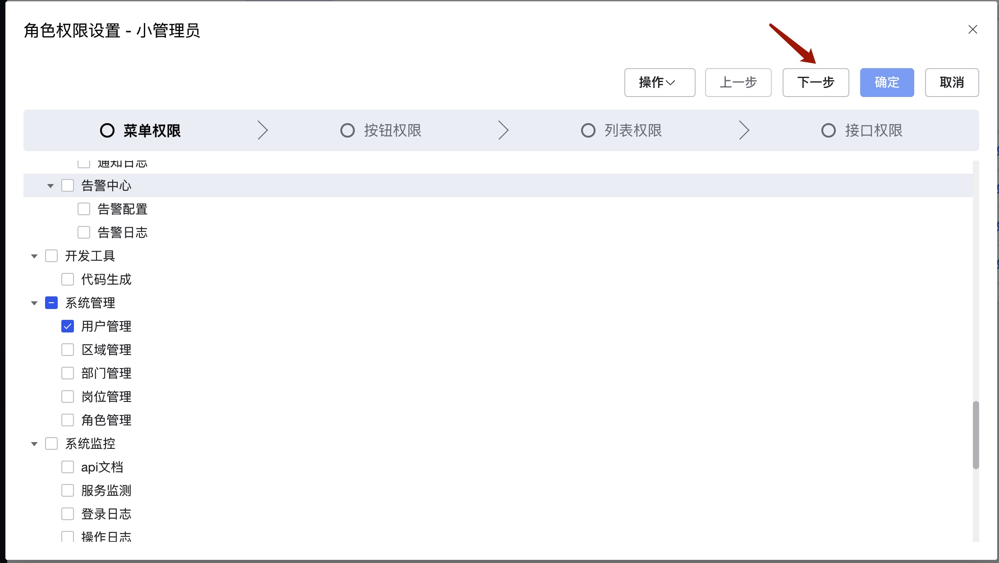

    2. 授权对应的按钮权限，点击下一步授权列表

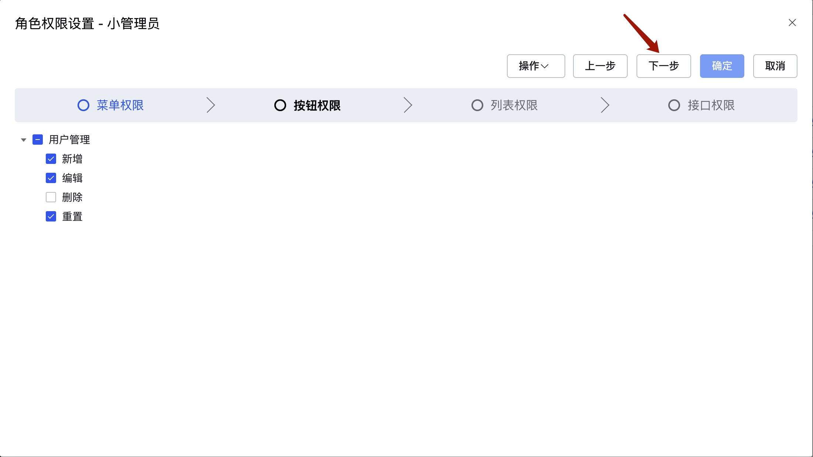

    3. 授权对应的列表权限，点击下一步授权访问权限

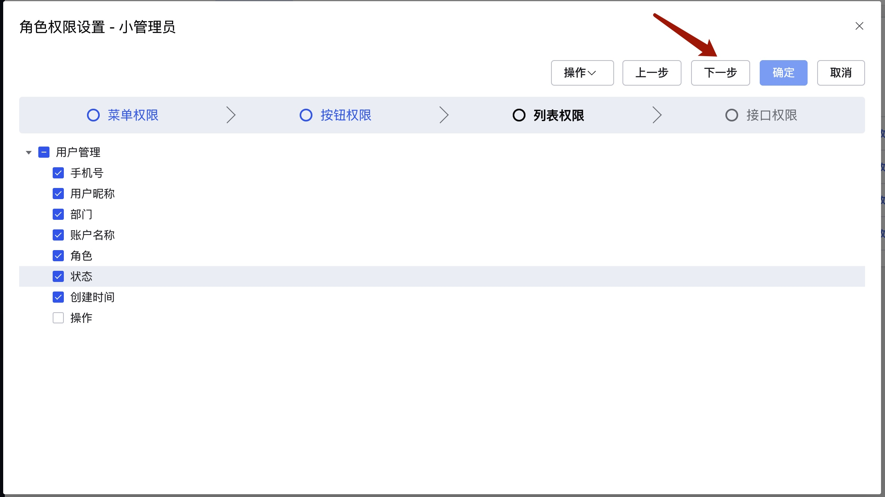

    4. 访问权限授权完后，点击确认

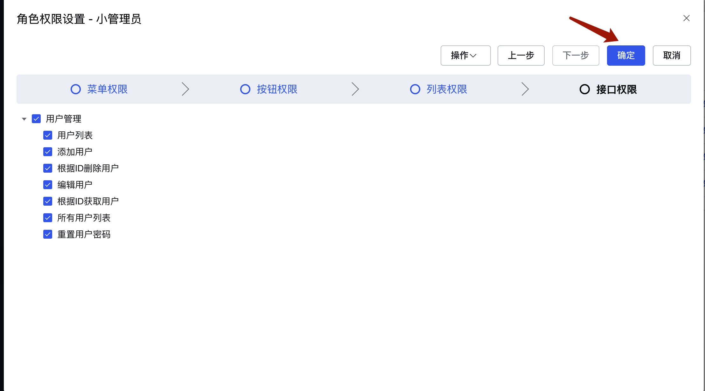

## 数据权限

1. 系统管理-角色管理中配置数据权限

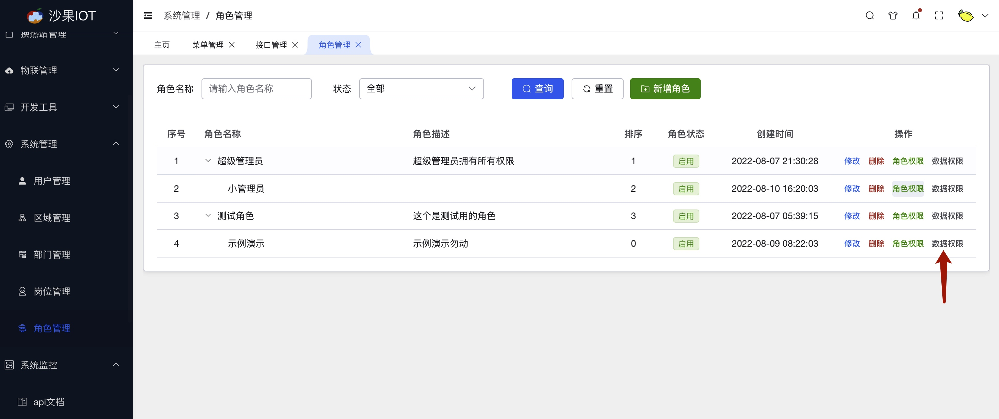

2. 配置数据权限，可以依据部门及自定义授权查看数据，也可授权全部数据

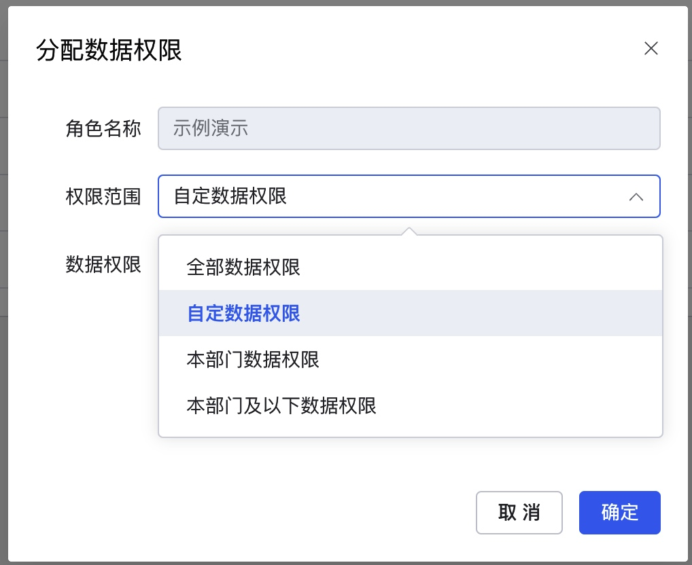

