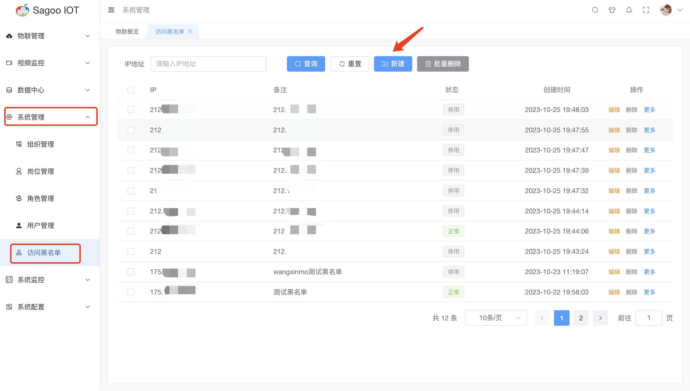
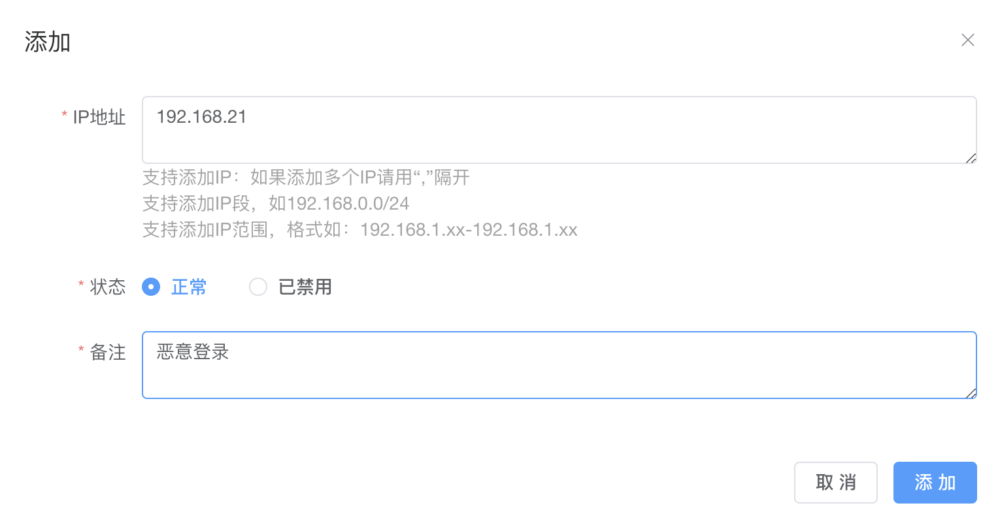
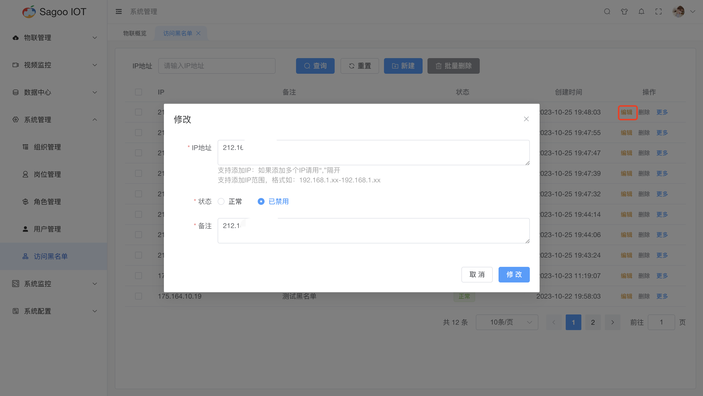
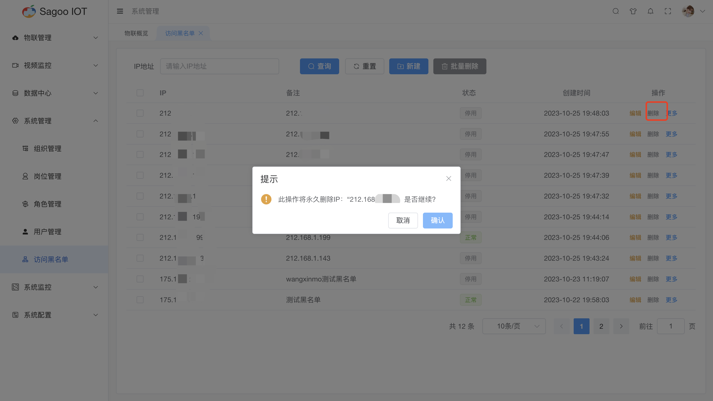

# 访问黑名单

SagooIoT系统提供了访问黑名单功能，可限制被禁止访问的指定IP或是IP地址段。

## 创建黑名单

1. 请确保已登录SagooIOT物联网平台。

2. 在左侧导航栏中，选择系统管理->访问黑名单

3. 创建黑名单
   * 点击“新建”按钮。
   
* 在弹出的对话框中，输入必填项。
  
* 确定后，系统将创建并显示新的黑名单。

## 修改黑名单信息

* 如果需要编辑黑名单的名称或其他信息，可以在黑名单列表项点击“编辑”按钮进行修改。
  

## 删除黑名单信息

* 如果需要删除黑名单的信息，可以在黑名单列表项点击“删除”按钮进行删除。
  

## 页面内容说明

| 参数名称 | 描述                     |
|------|------------------------|
| IP地址  | 必填输入框，是对黑名单用户进行本地ip进行拦截。 |
| 状态   | 黑名单状态变更，默认状态为正常。|
| 备注   | 必填输入框，是对黑名单进行定义。|
注：
* 支持添加IP：如果添加多个IP请用“,”隔开。
* 支持添加IP段，如192.168.0.0/24。
* 支持添加IP范围，格式如：192.168.1.xx-192.168.1.xx。
