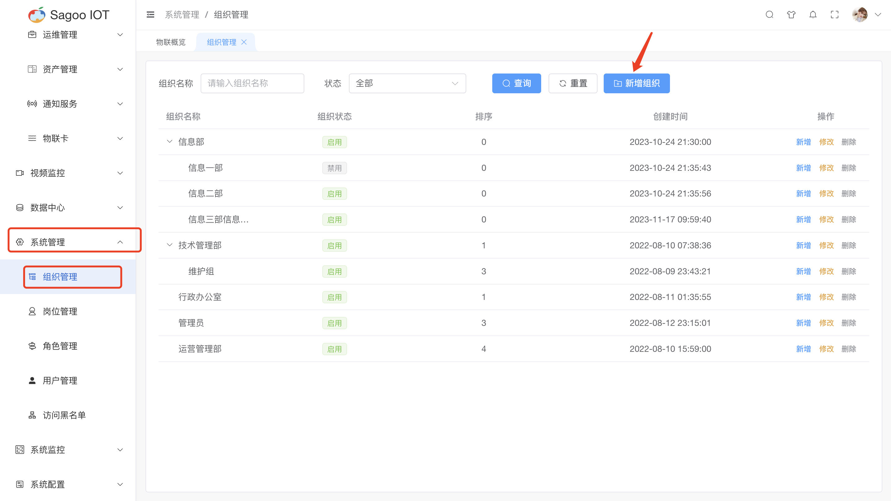
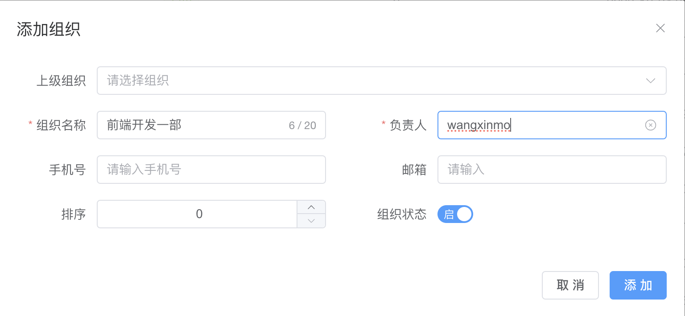
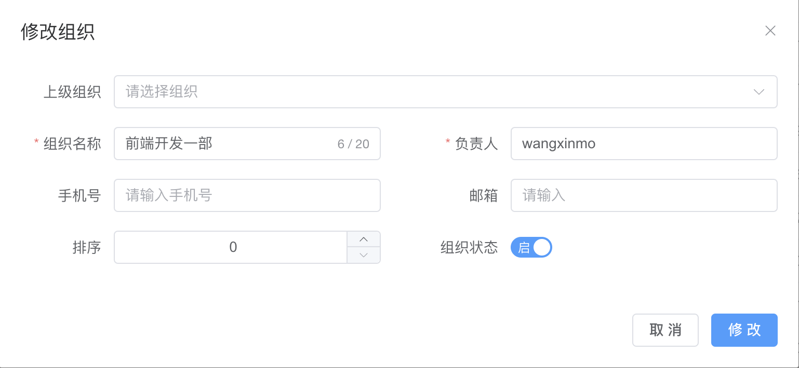

# 组织管理

系统提供组织层级的管理，通过组织层级可以进行按组织的分权管理，也可以通过组织管理配合应用管理进行多租户服务的实现。

## 创建组织

1. 请确保已登录SagooIOT物联网平台。

2. 在左侧导航栏中，选择系统管理->组织管理

3. 创建组织
点击“新增组织”按钮。
  
在弹出的对话框中，输入必填项。
  
确定后，系统将创建并显示新的组织。

| 参数名称  | 描述                                         |
|-------|--------------------------------------------|
| 上级组织  | 非必选项，是对上级组织进行定义。支持树状结构展示。）                 |
| 组织名称  | 必填输入框，是对组织名称进行定义。限制为40个字符。                 |
| 负责人  | 必填输入框，是对组织的负责人进行定义。                        |
| 手机号 | 非必填输入框，是对负责人手机号进行定义。                       |
| 邮箱 | 非必填输入框，是对邮箱进行定义。                           |

## 修改组织信息

如果需要编辑组织的名称或其他信息，可以在组织列表项点击“修改”按钮进行修改。
  

## 删除组织信息

如果需要删除组织的信息，可以在组织列表项点击“删除”按钮进行删除。
  

