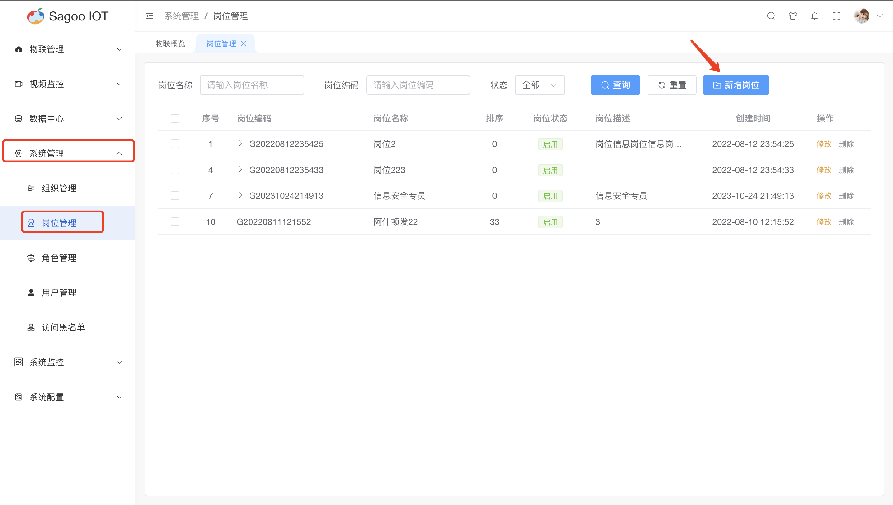
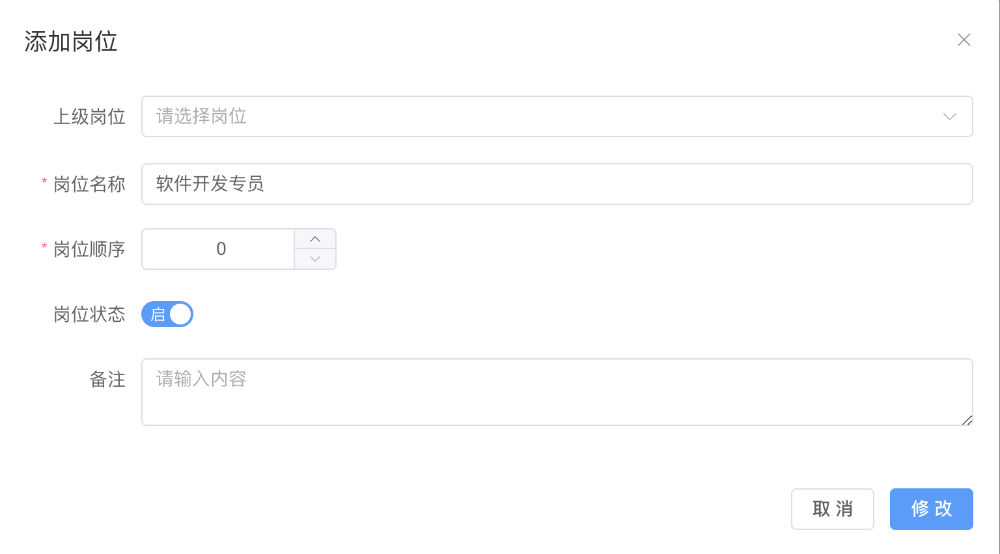
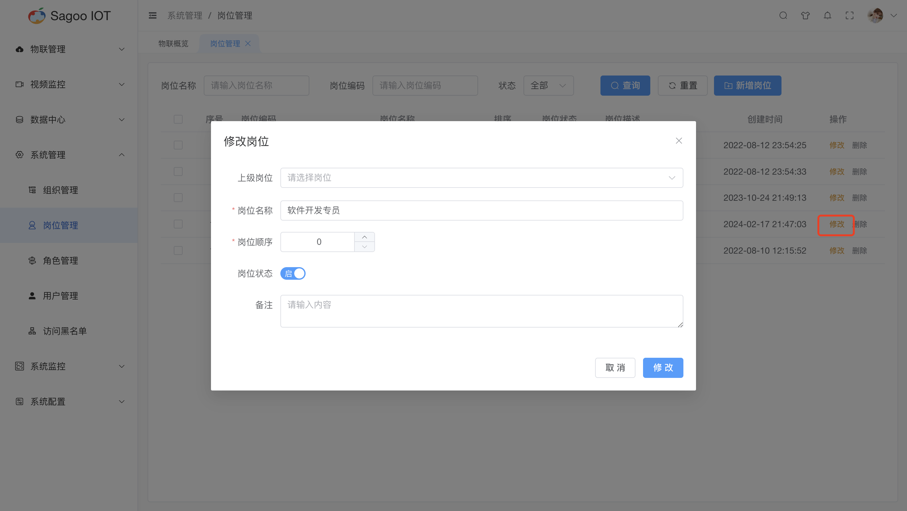
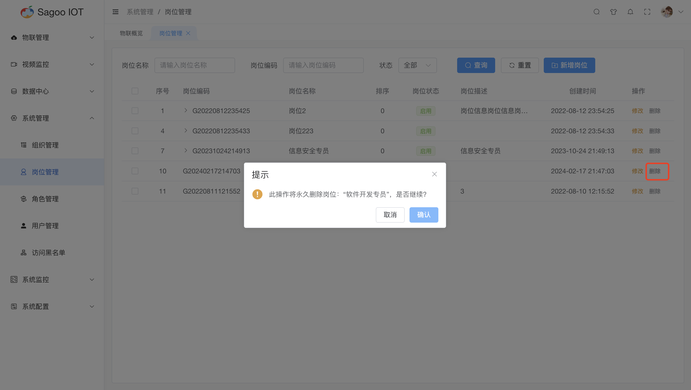

# 岗位管理

## 创建岗位

1. 请确保已登录SagooIOT物联网平台。

2. 在左侧导航栏中，选择系统管理->岗位管理

3. 创建岗位
点击“新增岗位”按钮。
  
在弹出的对话框中，输入必填项。
  
确定后，系统将创建并显示新的岗位。

| 参数名称  | 描述                     |
|-------|------------------------|
| 上级岗位  | 非必选，是对上级岗位进行定义。        |
| 岗位名称  | 必填输入框，是对岗位名称进行定义。      |
| 岗位顺序 | 必填输入框，是对岗位的权重进行定义。     |
| 岗位状态 | 非必填输入框，岗位状态变更，默认状态为启用。 |
| 备注 | 非必填输入框，是对岗位进行定义。       |

## 修改岗位信息

如果需要编辑岗位的名称或其他信息，可以在岗位列表项点击“修改”按钮进行修改。
  

## 删除岗位信息

如果需要删除岗位的信息，可以在岗位列表项点击“删除”按钮进行删除。
  

