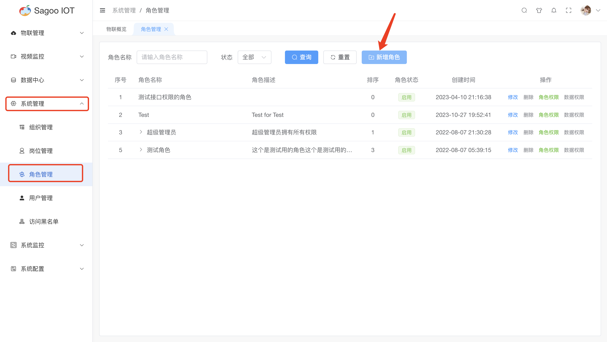
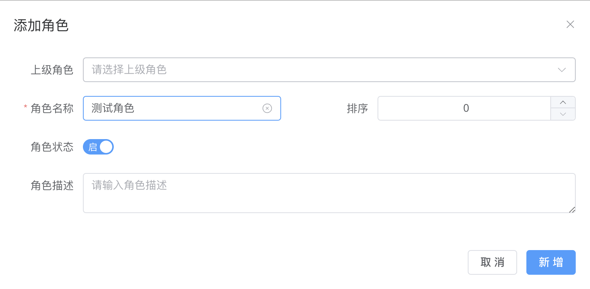
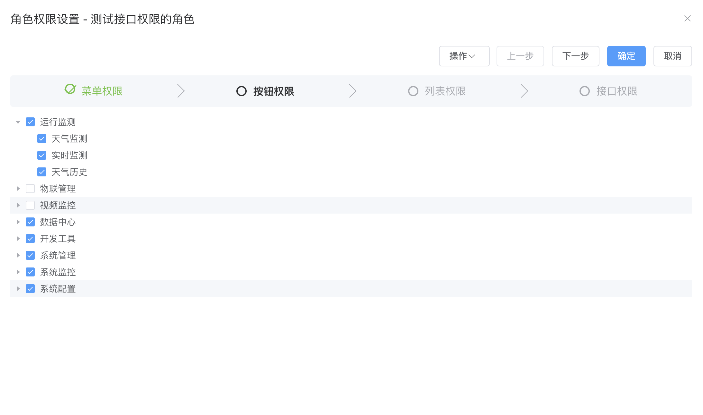
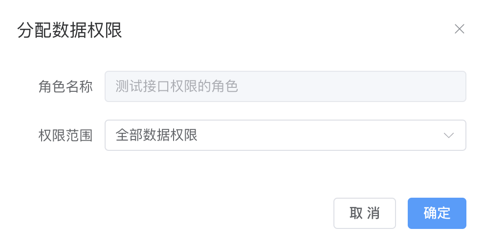
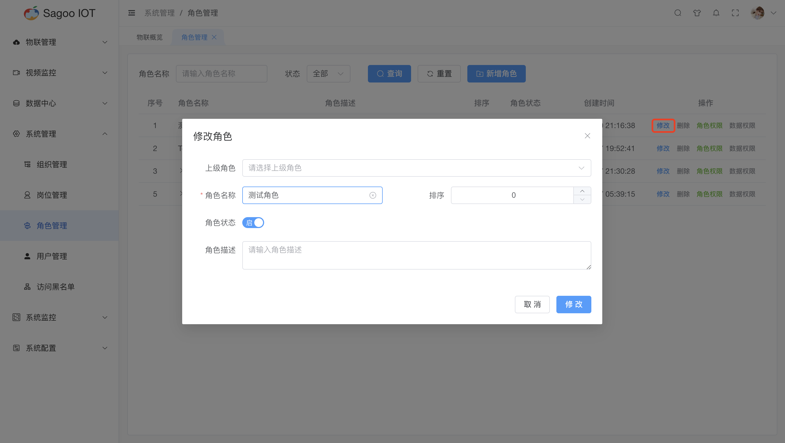
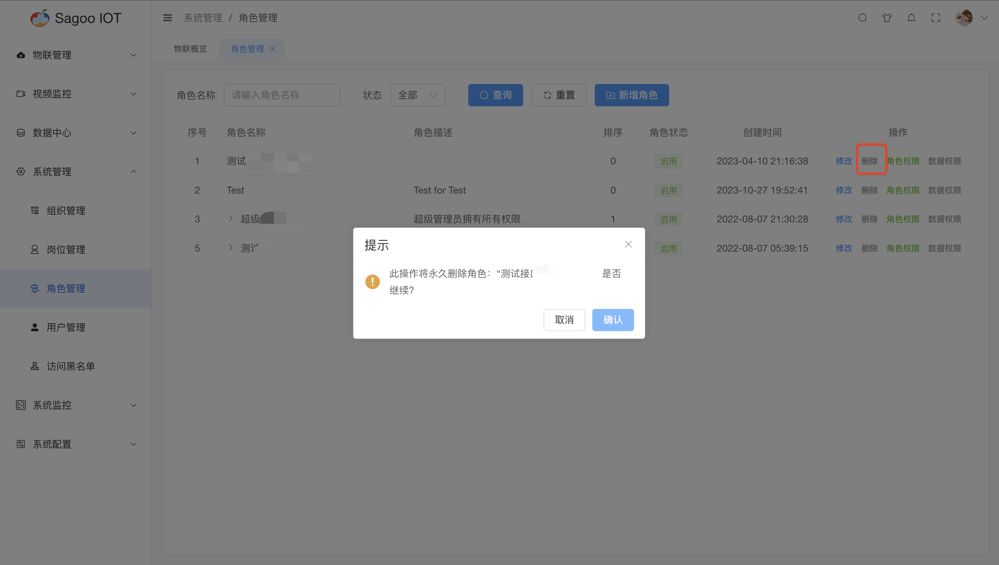

# 角色管理

角色管理是指在系统中管理用户角色及其权限的过程。它包括定义不同的用户角色，分配相应的权限，并确保用户只能访问其需要的功能和数据。

## 创建角色

1. 请确保已登录SagooIOT物联网平台。

2. 在左侧导航栏中，选择系统管理->角色管理

3. 创建角色
点击“新增角色”按钮。
  
在弹出的对话框中，输入必填项。
  
确定后，系统将创建并显示新的角色。

| 参数名称  | 描述                 |
|-------|--------------------|
| 上级角色  | 非必填下拉框，是对上级角色进行定义。 |
| 角色名称  | 必填下拉框，是对角色名称进行定义。  |
| 排序 | 非必填，是对角色的权重进行定义。   |
| 角色状态 | 岗位状态变更，默认状态为启用。    |
| 角色描述| 非必填输入框，是对角色描述进行定义。 |

## 角色权限

是对角色进行菜单权限、按钮权限、列表权限、接口权限的控制。勾选则该角色有相对应的权限。

## 数据权限

是对数据权限进行划分，包含全部数据权限、自定数据权限、本组织数据权限、本组织及以下数据权限。

## 修改角色信息

如果需要编辑角色的名称或其他信息，可以在角色列表项点击“修改”按钮进行修改。
  

## 删除角色信息

如果需要删除角色的信息，可以在角色列表项点击“删除”按钮进行删除。
  

