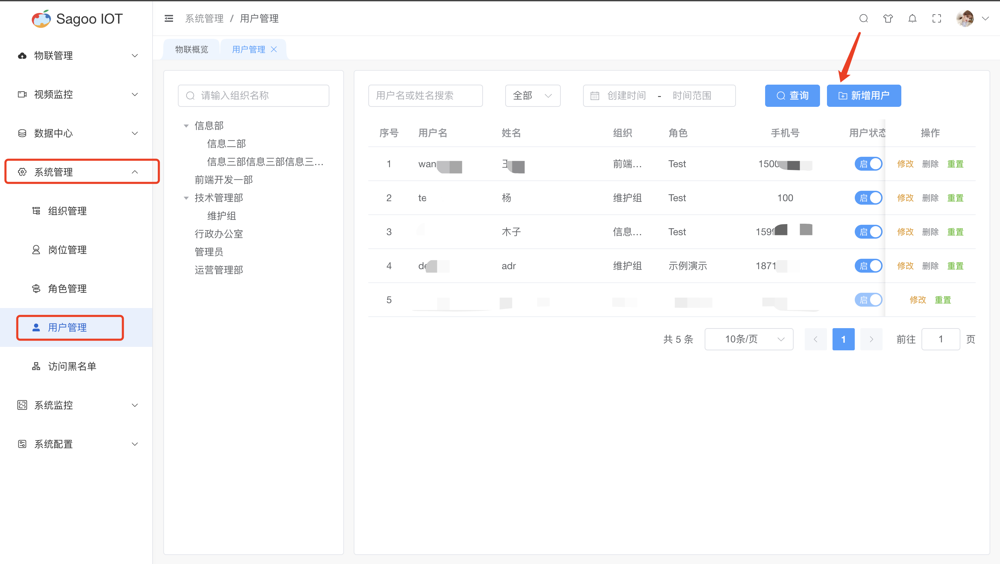
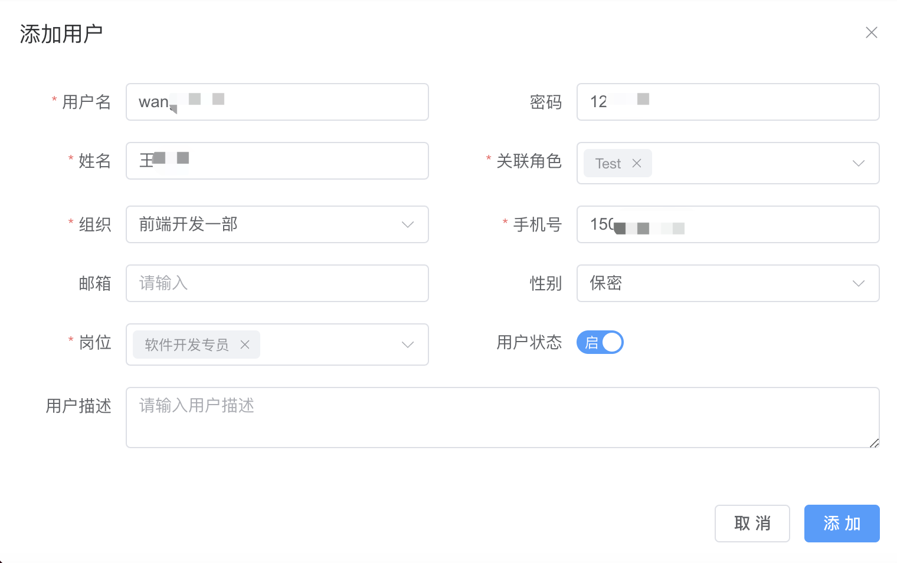
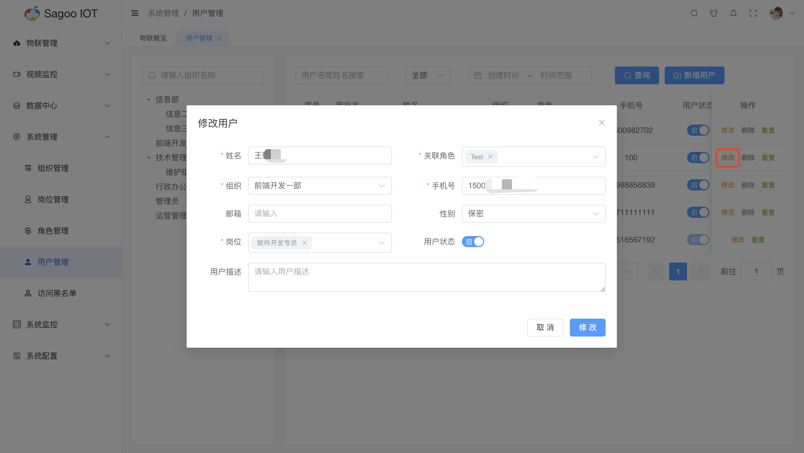
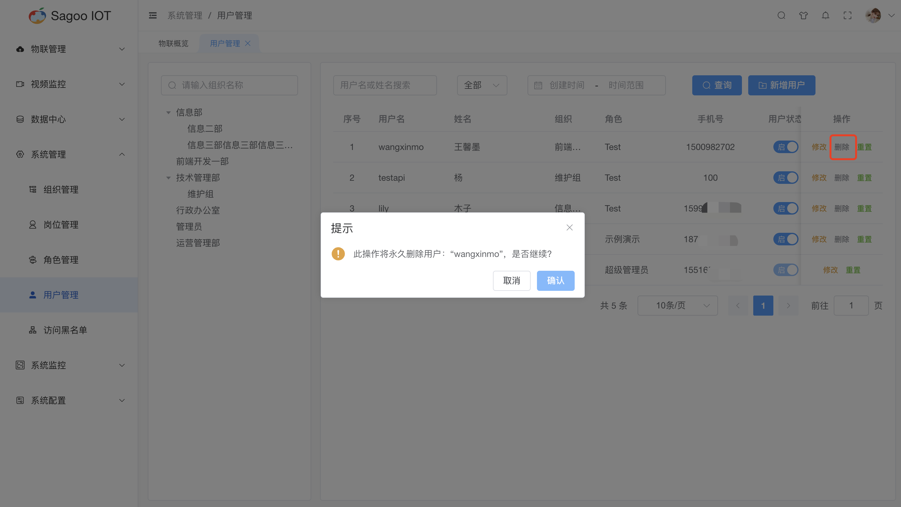
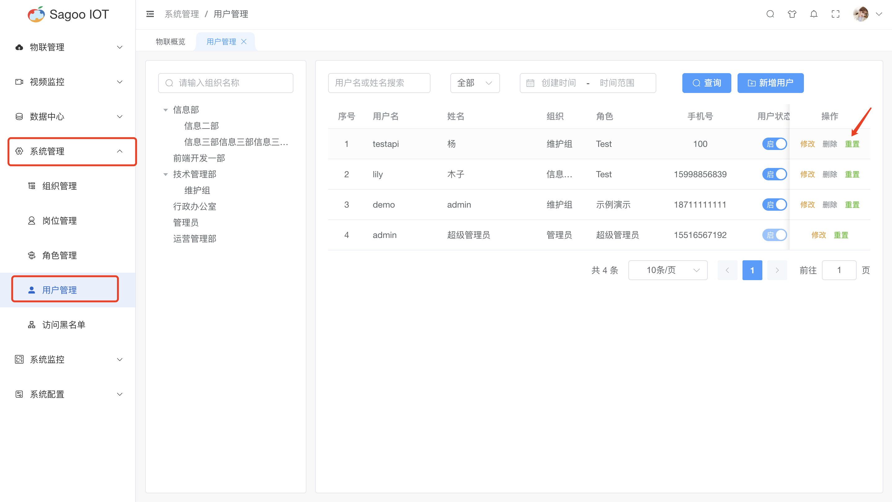
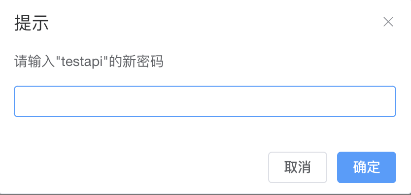

# 用户管理

用户管理是指组织或系统对其用户进行有效的规划、创建、维护和管理的过程。这涉及到管理用户的身份、权限、信息以及与系统的交互。

## 创建用户

1. 请确保已登录SagooIOT物联网平台。

2. 在左侧导航栏中，选择系统管理->用户管理

3. 创建用户
点击“新增用户”按钮。
  
在弹出的对话框中，输入必填项。
  
确定后，系统将创建并显示新的用户。

| 参数名称 | 描述             |
|------|----------------|
| 用户名  | 必填输入框，是对用户名进行定义。|
| 密码   | 非必填输入框，是对登录密码进行定义。|
| 姓名   | 必填输入框，是对姓名进行定义。|
| 关联角色 | 必填下拉框，是对用户角色进行定义。|
| 组织   | 必填下拉框，是对用户的组织进行定义。|
| 手机号  | 必填输入框，是手机号进行定义。|
| 邮箱   | 非必填输入框，是对邮箱进行定义。|
| 性别   | 非必填下拉框，是对用户的性别进行定义。|
| 岗位   | 必填下拉框，是对用户的岗位进行定义。|
| 用户状态  | 用户状态变更，默认状态为启用。|
| 用户描述  | 非必填输入框，是对用户描述进行定义。|

## 修改用户信息

如果需要编辑用户的名称或其他信息，可以在用户列表项点击“修改”按钮进行修改。
  

## 删除用户信息

如果需要删除用户的信息，可以在用户列表项点击“删除”按钮进行删除。
  

## 用户密码重置
1. 请确保已登录SagooIOT物联网平台。
2. 在左侧导航栏中，选择系统管理->用户管理
3. 重置用户密码
点击“重置”按钮。
  
在弹出的对话框中，输入用户要重置的新密码。
  
确定后，系统将重置用户密码。

