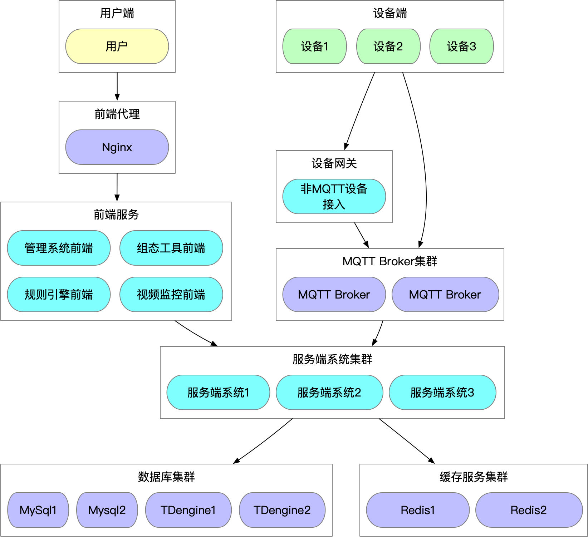

# 部署说明


该程序可以独立部署，直接执行使用，也可以与nginx或是apache联合使用。


## 硬件要求

**最低配置**

|CPU|1核心|
|--|--|
|内存|1GB|
|硬盘|40G|

**推荐配置**

|CPU|4核+|
|--|--|
|内存|16GB+|
|硬盘|40GB+|

SagooIOT的系统采用Golang开发，系统本身对于环境要求不高。主要是基础环境的要求。
可以参考TDengine系统运行所需要的内存、CPU 以及硬盘空间。 [TDengine容量规划](https://docs.taosdata.com/operation/planning/)

## 支持平台
SagooIOT采用Golang开发，拥有良好的跨平台特性，主要支持linux、windows、MacOS等。详细支持的平台如下：

```
aix/ppc64
android/386
android/amd64
android/arm
android/arm64
darwin/amd64
darwin/arm64
dragonfly/amd64
freebsd/386
freebsd/amd64
freebsd/arm
freebsd/arm64
illumos/amd64
js/wasm
linux/386
linux/amd64
linux/arm
linux/arm64
linux/mips
linux/mips64
linux/mips64le
linux/mipsle
linux/ppc64
linux/ppc64le
linux/riscv64
linux/s390x
netbsd/386
netbsd/amd64
netbsd/arm
netbsd/arm64
openbsd/386
openbsd/amd64
openbsd/arm
openbsd/arm64
plan9/386
plan9/amd64
plan9/arm
solaris/amd64
windows/386
windows/amd64
windows/arm
```

## 独立部署

服务器推荐使用Unix服务器系列(包括:Linux, MacOS, *BSD)，以下使用Linux系统为例，介绍如何部署。
将应用服务目录复制到目标位置，里面写好了执行的脚本，通过脚本来执行。


```
curl.sh脚本参数：

start|stop|restart|status|tail

```


## 代理部署

推荐使用Nginx作为反向代理的前端接入层，有两种配置方式实现动静态请求的拆分。

```
server {
    listen       80;
    server_name  www.abc.org;

    access_log   /var/log/gf-app-access.log;
    error_log    /var/log/gf-app-error.log;

    location ~ .*\.(gif|jpg|jpeg|png|js|css|eot|ttf|woff|svg|otf)$ {
        access_log off;
        expires    1d;
        root       /var/www/gf-app/public;
        try_files  $uri @backend;
    }

    location / {
        try_files $uri @backend;
    }

    location @backend {
        proxy_pass                 http://127.0.0.1:8200;
        proxy_redirect             off;
        proxy_set_header           Host             $host;
        proxy_set_header           X-Real-IP        $remote_addr;
        proxy_set_header           X-Forwarded-For  $proxy_add_x_forwarded_for;
    }
}

```

其中，8200为本地编译的应用Web服务监听端口。这个端口在config.toml文件的Address参数中配置。

**如果采用HTTPS方式时SSE不工作，需要如下配置：**

```Nginx
    proxy_set_header Connection '';
    proxy_http_version 1.1;
    chunked_transfer_encoding off; 
```


## 集群部署图

**系统部署图**




- 如果使用集群，可以开启redis token模式；在SagooIOT的主程序中修改配置文件如下：

```
# 缓存模式 1 gcache 2 gredis
cache-mode = 2

# Redis数据库配置
[redis]
  default = "127.0.0.1:16379,0,soccer"
  cache   = "127.0.0.1:16379,1,soccer?idleTimeout=600"
```

- mysql数据库集群 【[参考这个内容](https://zhuanlan.zhihu.com/p/365812699)】
- EMQX 集群【[参考这个内容](https://docs.emqx.com/zh/emqx-terraform/latest/getting-started/getting-started-ali.html)】
- TDengine 集群【[参考这个内容](https://docs.taosdata.com/deployment/deploy/)】
- SagooIOT主系统做多个部署，需要通过Nginx进行路由分发。

  


