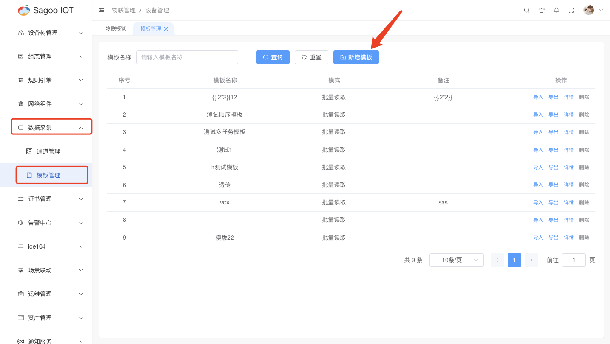
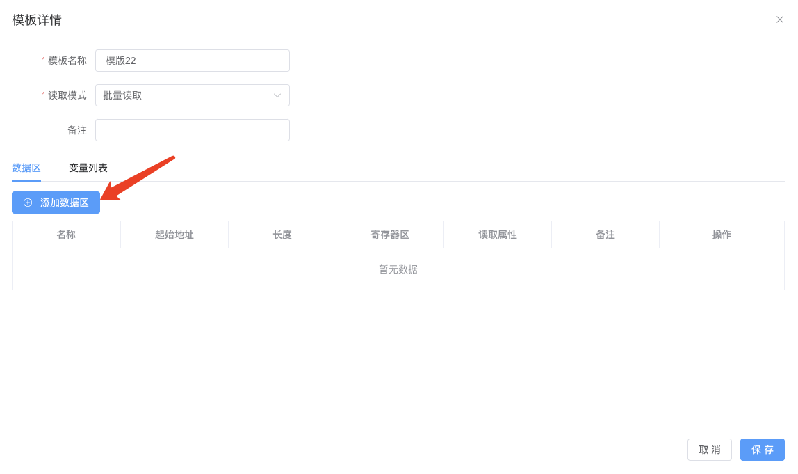
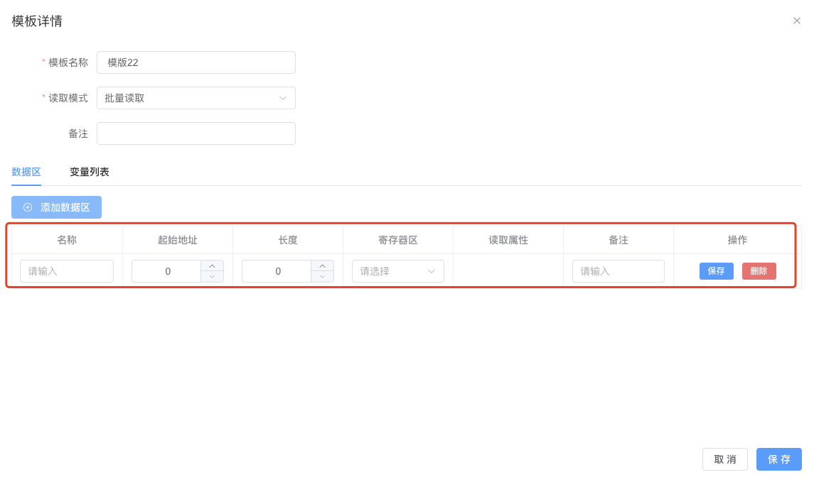

# 模版管理

## 模版管理说明

模版管理是对设备的数据区和变量列表进行管理，用户可以在模版管理中创建模版、数据区和变量列表，以便于后续设备的绑定。

## 创建模版

1. 请确保已登录SagooIOT物联网平台。

2. 在左侧导航栏中，选择系统配置->模版管理

3. 创建模版
点击“新增模版”按钮。
  
在弹出的对话框中，输入必填项。
  
确定后，系统将创建并显示新的模版。

| 参数名称 | 描述                |
|------|-------------------|
| 模版名称 | 必填输入框，是对模版名称进行定义。 |
| 读取模式 | 必选框，是对读取模式进行定义。   |
| 备注   | 非必填输入框，是对备注进行定义。  |

## 数据区

1. 请确保已登录SagooIOT物联网平台。

2. 在左侧导航栏中，选择系统配置->模版管理->详情

3. 添加数据区
点击“添加数据区”按钮。
  
在弹出的对话框中，输入必填项。
  
确定后，系统将创建并显示新的数据区。

| 参数名称 | 描述            |
|------|---------------|
| 名称   | 是对数据区的名称进行定义。 |
| 起始地址 | 是对起始地址进行定义。   |
| 长度   | 是对数据长度进行定义。   |
| 寄存器区 | 是对寄存器进行定义。    |
| 读取属性 | 是对读取属性进行定义。   |
| 备注   | 是对备注进行定义。     |

## 变量列表

1. 请确保已登录SagooIOT物联网平台。

2. 在左侧导航栏中，选择系统配置->模版管理->详情

3. 添加变量列表
点击“添加变量列表”按钮。
  
在弹出的对话框中，输入必填项。
  
确定后，系统将创建并显示新的变量。

| 参数名称 | 描述                 |
|------|--------------------|
| 变量名称 | 必填输入框，是对变量名称进行定义。  |
| 变量编码 | 必填输入框，是对变量编码进行定义。  |
| 单位   | 非必填输入框，是对变量单位进行定义。 |
| 数据区  | 必填下拉框，是对数据区进行定义。   |
| 数据地址 | 必填下拉框，是对数据地址进行定义。  |
| 数据类型 | 必填下拉框，是对数据类型进行定义。  |
| 初始值  | 是对变量初始值进行定义。       |
| 基值   | 是对变量基值进行定义。        |
| 系数   | 是对变量系数进行定义。        |
| 存盘周期 | 是对变量存盘周期进行定义。      |

## 删除模版信息

如果需要删除模版的信息，可以在模版列表项点击“删除”按钮进行删除。
  

