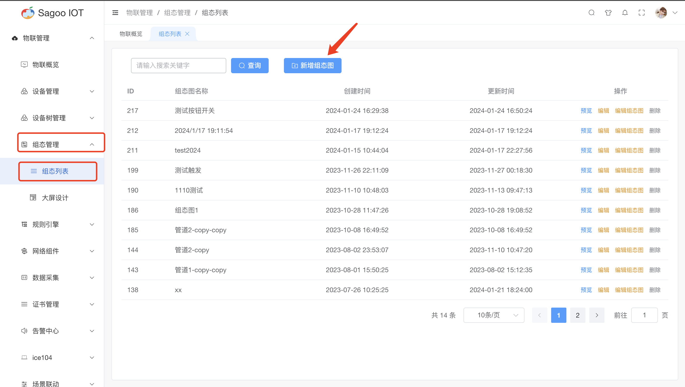

# 组态列表

## 组态列表说明

组态图是一种图形化表示，用于展示系统、设备或流程的配置、连接和关系。

## 创建组态

1. 请确保已登录SagooIOT物联网平台。

2. 在左侧导航栏中，选择物联管理->组态管理->组态列表

3. 创建组态
点击“新增组态图”按钮。
  
在弹出的对话框中，输入必填项。
  
确定后，系统将创建并显示新的组态。

## 编辑组态图

* 编辑组态图主要是对组态图进行基础设计及数据信息绑定等。
* 编辑组态图请参考[编辑组态图](edit-configuration-diagram.md)

## 修改组态信息

如果需要编辑组态的名称或其他信息，可以在组态列表项点击“编辑”按钮进行修改。
  

## 删除组态信息

如果需要删除组态的信息，可以在组态列表项点击“删除”按钮进行删除。
  

