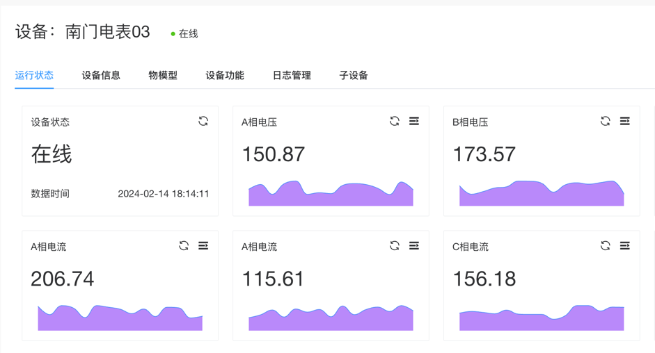

# 设备

完成产品的填加，并启用产品后，可以在这个功能页面为产品添加设备。设备列表页面提供筛选、新增设备、启用/停用设备，导入/导出设备等功能功能模块。

## 添加设备

点击`新增设备`按钮，弹出新增设备的弹窗，填写设备标识、设备名称、设备所属产品等信息，点击`添加`按钮即可完成设备的添加。

| 设置项  | 说明                                                          |
|------|-------------------------------------------------------------|
| 设备标识 | 必填项，设备的标识信息，也可以称为设备KEY，是设备的唯一标识信息。在系统中不可以重复                 |
| 设备名称 | 必填项，设备名称，建议名称起的识别度高一些                                           |
| 所属产品 | 必填项，这里列出当前已启用的产品，选择这个设备所属的产品                                    |
| 设备坐标 | 设备地图需要的数据，设置设备所在的地图位置，当前支持的是百度地图。需要在`参数管理`中配置百度地图的访问密钥才可以使用 |
| 标签设置 | 设备的自定义分类信息                                                  |

其它信息默认可以不填写。

## 设备详情

点击设备列表中的右侧的操作区域的`详情`，可以查看设备的详情信息。设备详情页面展示运行状态、设备信息、物模型、设备功能、日志管理、如果是网关设备还会有子设备信息等模块。

### 运行状态

设备的运行状态信息，包括设备的在线状态、数据上报时间、实时数据等。可以在这个模块中查看设备的单个属性的实时运行状态信息。

### 设备信息
显示设备的基本信息，包括设备的标识、设备名称、所属产品、设备注册时间、设备最后上线时间等信息。

:::tip 提示  设置设备的超时时间
在设备信息中，可以设置设备的超时时间，超时时间是指设备多少时间没有数据上报，超过这个时间后，设备会被系统认为是离线状态。
:::

### 物模型

设备中的物模型信息，包括设备的属性、事件、服务等信息。这些信息就是设备所属的产品的物模型信息。如果在这儿个地方对物模型进行修改，会影响到设备的功能，则数据存为设备专属的物模型信息。非特殊情况不建议在设备里修改物模型的信息。

### 设备功能
设备功能，为在产品物模型中进行的功能定义。录入参数后点击执行，可以调用功能并查看执行结果。

### 日志管理
设备的日志信息，包括设备的功能操作日志、设备的上报数据日志等信息。可以在这个模块中查看设备的操作日志信息。

### 子设备信息
如果当前设备是网关设备，会在这个模块中显示网关设备下的子设备信息。子设备信息包括子设备的标识、子设备的名称、子设备的在线状态等信息。

## 删除设备

在设备列表中，可以对单个设备进行删除操作。也支持批量的删除操作。

## 启用/禁用 设备

在设备列表中，可以对单个设备进行启用/禁用操作。也支持批量的启用/禁用操作。

批量操作时，选择需要操作的多个设备，点击`更多`操作按钮，选择批量启用/批量禁用 操作按钮即可。

## 导入/导出 设备
支持将设备信息批量的导出到本地文件，也支持将本地文件中的设备信息导入到系统中。

注意：导入的文件格式必须是系统支持的格式，导出的文件格式也是系统支持的格式。导入数据的时候，请先下载系统支持的模板文件，然后将数据填写到模板文件中，再进行导入操作。

