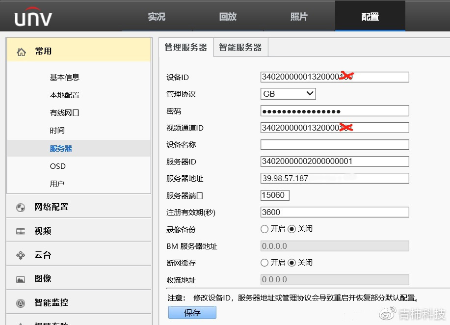
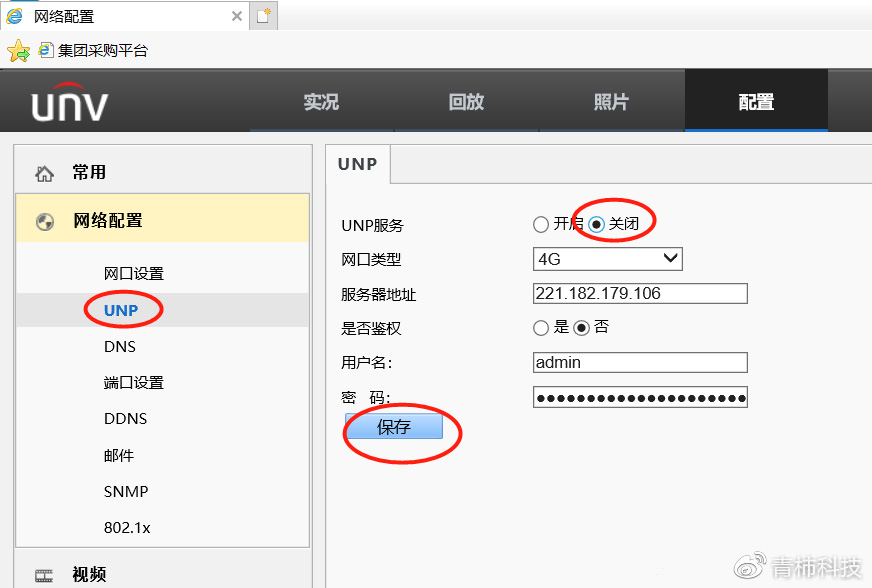
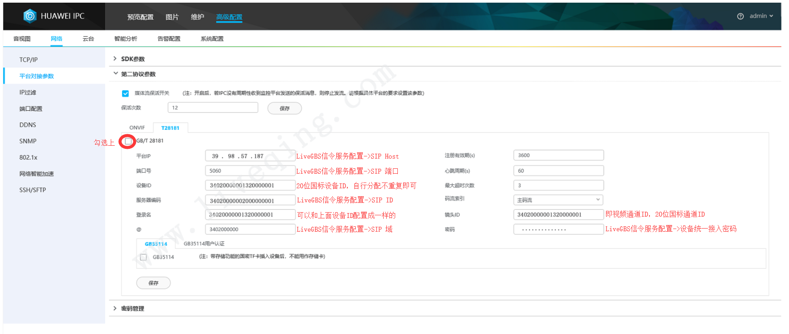

# GB28181接入

**使用SIP协议接受NVR或其他GB28181设备的注册**

- 服务器启动时自动监听SIP协议端口，当有设备注册时，会记录该设备信息，可以从UI的列表中看到设备
- 定时发送Catalog命令查询设备的目录信息，可获得通道数据或者子设备
- 发送RecordInfo命令查询设备对录像数据
- 发送Invite命令获取设备的实时视频或者录像视频
- 发送PTZ命令来控制摄像头云台

**作为GB28281的流媒体服务器接受设备的媒体流**

- 当invite设备的**实时**视频流时，会在SagooMedia中创建对应的流，StreamPath由设备编号和通道编号组成，即[设备编号]/[通道编号],如果有多个层级，通道编号是最后一个层级的编号
- 当invite设备的**录像**视频流时，StreamPath由设备编号和通道编号以及录像的起止时间拼接而成即[设备编号]/[通道编号]/[开始时间]-[结束时间]


**注意：**

1，只支持264码流

2，不可以进行合流

##  默认插件配置默认配置

```
[GB28181]
Serial = "34020000002000000001"
Realm = "3402000000"
Expires = 3600
ListenAddr = "127.0.0.1:5060"
AutoUnPublish = true 
AutoInvite = false
MediaPort = 58200
CatalogInterval = 30
```

- `ListenAddr`是监听的地址，这里需要注意的是必须要带上Server的IP地址，这个IP地址是向设备发送信息的时候需要带上的。
- `Serial` Server（SIP）的编号
- `Realm` Server（SIP）的域
- `AutoUnPublish` 如果设置为true，则当某个流最后一个订阅者取消订阅时，会自动发送bye，节省流量。如果为了响应及时，可以设置成false，保持流的连接
- `AutoInvite` 表示自动发起invite，当Server（SIP）接收到设备信息时，立即向设备发送invite命令获取流
- `MediaPort` 表示用于接收设备流的端口号
- `CatalogInterval` 定时获取设备目录的间隔，单位秒


## 各型号摄像头配置

可以参考下面的介绍，注意图中LiveGBS->基础配置->信令服务配置，在SagooMedia的config.toml中对应关系为

Config.toml 中信令服务配置：

```
[GB28181]
Serial = "34020000002000000001"  # SIP ID
Realm = "3402000000" # SIP 域
Expires = 3600 
ListenAddr = "127.0.0.1:5060" # SIP host和端口  配置过程中，需要变更为服务器IP地址和端口
```

## 海康GB28181接入示例


## NVR硬件GB28181接入示例

说明：视频通道编码ID，如果配置为空表示不作为通道接入到LiveGBS。如下图所示，只有通道1和通道2会接入到LiveGBS。


## 大华GB28181接入示例


## 宇视4G GB28181接入示例





## 华为IPC GB28181接入示例



PS: 以上接入示例需要将SIP ID、SIP域、SIP服务器IP、SIP服务器端口号变更为服务SagooMedia的config.toml的配置信息


