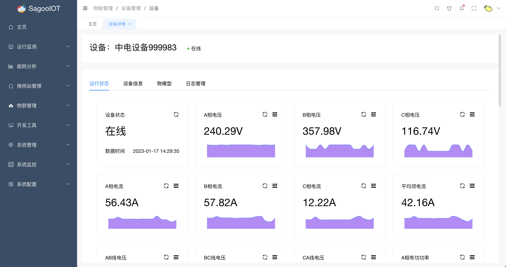
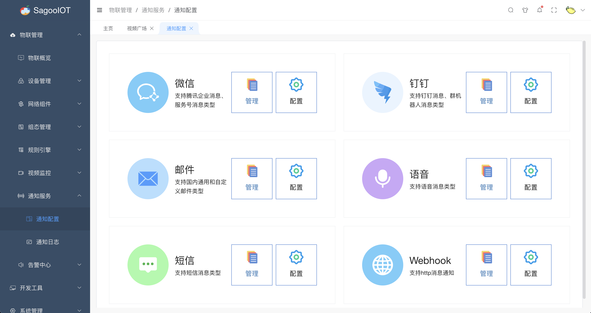
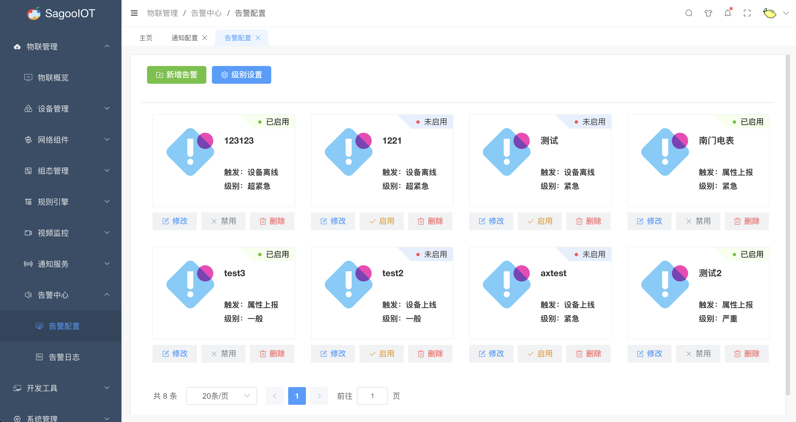
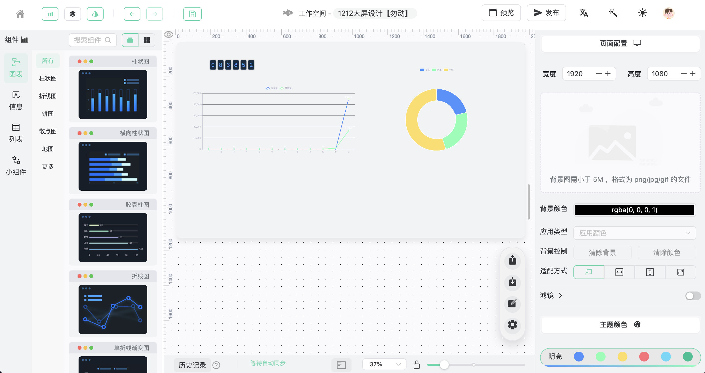

# 页面展示

## 支持的浏览器

推荐使用最新版的Chrome浏览器，以获得更好的用户体验。

| Edge      | Firefox      | Chrome      | Safari      |
| --------- | ------------ | ----------- | ----------- |
| Edge ≥ 79 | Firefox ≥ 78 | Chrome ≥ 64 | Safari ≥ 12 |

## 在线演示

[在线演示](https://zhgy.sagoo.cn)

用户名：demo  密码：demo123456

## 部分功能页面

|           |      |
|------------------------------------------------| --------------------------------------------------- |
|    |  |
|   |      |
|     |  |
|   |      |
|     |  |
|  |    |

