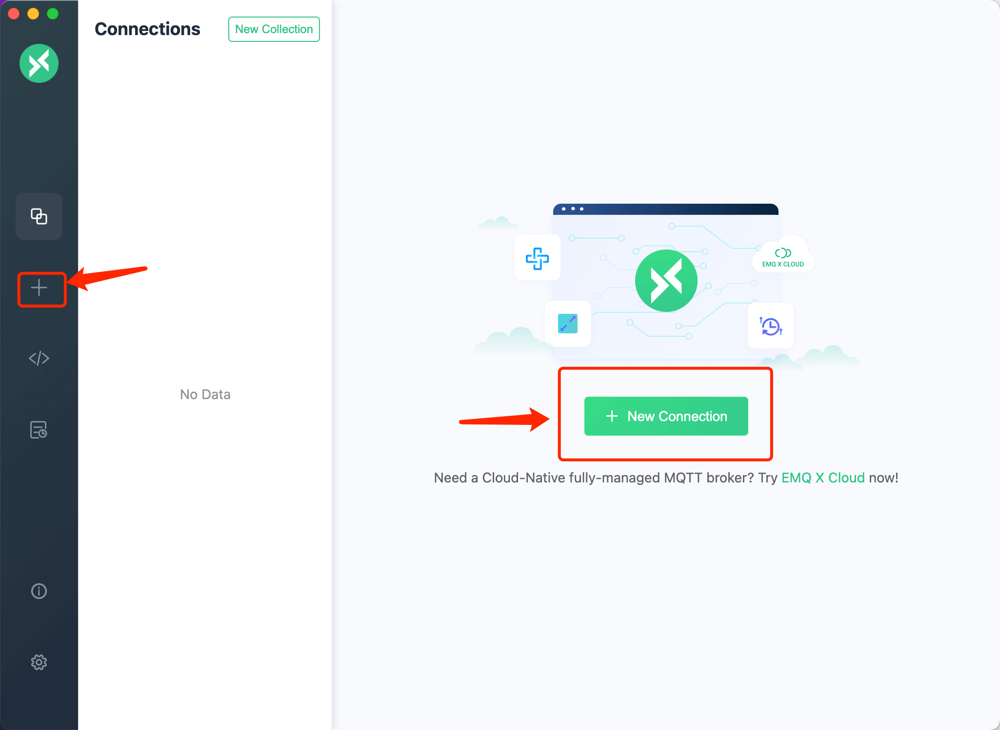

# MQTT 设备接入


通过一个模拟设备的接入，来演示系统接入设备的情况。以MQTTX为例，介绍使用第三方软件以MQTT协议接入SagooIOT物联网平台。

**注：这里采用的是SagooIOT官方标准Json格式数据** [非官方数据格式的处理请见这里](mqtt2.md)

## 下载并安装MQTTX

前往[官网下载](https://mqttx.app/)安装

## 使用MQTTX模拟设备

打开MQTTX软件，点击新建连接创建一个连接，设置连接参数。




 **连接参数说明**

| 参数      | 说明                                                         |
| --------- | ------------------------------------------------------------ |
| Name      | 输入您的自定义名称。                                         |
| Client ID | 设备Id。必须与系统中设备的ID填写一致。                       |
| Host      | 连接域名。本地连接可直接填写 `127.0.0.1`,如为远程连接，请跟据你的mqtt服务安装的连接地址进行设置。 |
| Port      | 请填写mqtt服务的端口。                                       |
| Username  | 填写mqtt接入账号                                             |
| Password  | 填写mqtt接入密码                                             |


## 设备数据上报

设备连接上平台后，就可进行一些事件上报、属性读取等操作。

MQTTX 进行数据上报


### 1、设备上报属性

#### 请求

本系统的mqtt设备数据上报的topic格式为：/sys/设备产品标识/设备标识/thing/event/property/post

**请求数据格式：**

```json
{
    "id": "123",
    "version": "1.0",
    "sys":{
        "ack":0
    },
    "params": {
        "Power": {
            "value": "on",
            "time": 1524448722000
        },
        "WF": {
            "value": 23.6,
            "time": 1524448722000
        }
    },
    "method": "thing.event.property.post"
}
```

字段说明

1. id：消息ID，用于唯一标识一条消息，由设备端生成，必须保证唯一性。
2. version：消息版本号，目前版本为1.0。
3. sys：系统级参数，目前仅支持ack，ack=0表示不需要应答，ack=1表示需要应答。
4. params：消息体，消息体中包含了设备上报的属性值，属性值的格式为JSON格式。
5. method：消息类型，目前仅支持thing.event.property.post。
6. Power：属性名称，必须与物模型中定义的属性名称一致。
7. value：属性值，必须与物模型中定义的属性类型一致。
8. time：属性值的时间戳，单位为毫秒，可选，如果不携带该字段，则默认为消息发送时间。

#### 应答

1. 应答Topic：`/sys/${productKey}/${deviceKey}/thing/event/property/post_reply
2. 应答数据格式：

```json
{
  "code": 200,
  "data": {},
  "id": "123",
  "message": "success",
  "method": "thing.event.property.post",
  "version": "1.0"
}
```

字段说明
   1. code：应答码，200表示成功，其他表示失败。
   2. data：应答数据，目前为空。
   3. id：消息ID，与请求中的消息ID一致。
   4. message：应答消息，目前为空。
   5. method：消息类型，目前仅支持thing.event.property.post。
   6. version：消息版本号，目前版本为1.0

### 2、设备上报事件

#### 请求

1. 请求Topic：`/sys/${productKey}/${deviceKey}/thing/event/${eventIdentifier}/post`
2. 请求数据格式：

```json
{
  "id": "123",
  "version": "1.0",
  "sys":{
    "ack":0
  },
  "params": {
    "value": {
      "Power": "on",
      "WF": "2"
    },
    "time": 1524448722000
  },
  "method": "thing.event.${tsl.event.identifier}.post"
}
```

字段说明

1. id：消息ID，用于唯一标识一条消息，由设备端生成，必须保证唯一性。
2. version：消息版本号，目前版本为1.0。
3. sys：系统级参数，目前仅支持ack，ack=0表示不需要应答，ack=1表示需要应答。
4. params：消息体，消息体中包含了设备上报的事件值，事件值的格式为JSON格式。
5. method：消息类型，目前仅支持thing.event.${tsl.event.identifier}.post。
6. value：事件值，必须与物模型中定义的事件类型一致。
7. time：事件值的时间戳，单位为毫秒，可选，如果不携带该字段，则默认为消息发送时间。

#### 应答

1. 应答Topic：`/sys/${productKey}/${deviceKey}/thing/event/${eventIdentifier}/post_reply`
2. 请求数据格式：

```json
{
  "code": 200,
  "data": {},
  "id": "123",
  "message": "success",
  "method": "thing.event.${tsl.event.identifier}.post",
  "version": "1.0"
}
```

字段说明

1. code：应答码，200表示成功，其他表示失败。
2. data：应答数据，目前为空。
3. id：消息ID，与请求中的消息ID一致。
4. message：应答消息，目前为空。
5. method：消息类型，目前仅支持thing.event.${tsl.event.identifier}.post。
6. version：消息版本号，目前版本为1.0

### 3、服务调用

#### 请求

1. 请求Topic：/sys/${productKey}/${deviceKey}/thing/service/${tsl.service.identifier}`
2. 请求数据格式：

```json
{
  "id": "123",
  "version": "1.0",
  "params": {
    "Power": "on",
    "WF": "2"
  },
  "method": "thing.service.${tsl.service.identifier}"
}
```

参数说明
1. id：消息ID，用于唯一标识一条消息，由设备端生成，必须保证唯一性。
2. version：消息版本号，目前版本为1.0。
3. params：消息体，消息体中包含了设备上报的事件值，事件值的格式为JSON格式。
4. method：消息类型，目前仅支持thing.service.${tsl.service.identifier}。

#### 应答

1. 应答Topic：`/sys/${productKey}/${deviceKey}/thing/service/${tsl.service.identifier}_reply`
2. 应答数据格式：

```json
{
  "code": 200,
  "data": {},
  "id": "123",
  "message": "success",
  "version": "1.0"
}
```

字段说明
1. code：应答码，200表示成功，其他表示失败。
2. data：应答数据，目前为空。
3. id：消息ID，与请求中的消息ID一致。
4. message：应答消息，目前为空。
5. version：消息版本号，目前版本为1.0

### 3、网关批量上传事件和属性

#### 请求

1. 请求Topic：`/sys/${productKey}/${deviceKey}/thing/event/property/pack/post`
2. 请求数据格式：

```json
{
  "id": "123",
  "version": "1.0",
  "sys":{
    "ack":0
  },
  "params": {
    "properties": {
      "Power": {
        "value": "on",
        "time": 1524448722000
      }
    },
    "events": {
      "alarmEvent1": {
        "value": {
          "param1": "on",
          "param2": "2"
        },
        "time": 1524448722000
      },
      "alertEvent2": {
        "value": {
          "param1": "on",
          "param2": "2"
        },
        "time": 1524448722000
      }
    },
    "subDevices": [
      {
        "identity": {
          "productKey": "",
          "deviceKey": ""
        },
        "properties": {
          "Power": {
            "value": "on",
            "time": 1524448722000
          },
          "WF": {
            "value": { },
            "time": 1524448722000
          }
        },
        "events": {
          "alarmEvent1": {
            "value": {
              "param1": "on",
              "param2": "2"
            },
            "time": 1524448722000
          },
          "alertEvent2": {
            "value": {
              "param1": "on",
              "param2": "2"
            },
            "time": 1524448722000
          }
        }
      }
    ]
  },
  "method": "thing.event.property.pack.post"
}
```

字段说明
1. id：消息ID，用于唯一标识一条消息，由设备端生成，必须保证唯一性。
2. version：消息版本号，目前版本为1.0。
3. sys：系统级参数，目前仅支持ack，ack=0表示不需要应答，ack=1表示需要应答。
4. params：消息体，消息体中包含了设备上报的事件值，事件值的格式为JSON格式。
5. method：消息类型，目前仅支持thing.event.property.pack.post。
6. properties：设备属性值，必须与物模型中定义的属性类型一致。
7. events：设备事件值，必须与物模型中定义的事件类型一致。
8. subDevices：子设备属性值和事件值，必须与物模型中定义的属性类型和事件类型一致。
9. identity：子设备标识，必须与物模型中定义的子设备标识一致。
10. value：属性值或事件值，必须与物模型中定义的属性类型或事件类型一致。
11. time：属性值或事件值的时间戳，单位为毫秒，可选，如果不携带该字段，则默认为消息发送时间。

#### 响应

1. 响应Topic：`/sys/${productKey}/${deviceKey}/thing/event/property/pack/post`
2. 响应数据格式：

```json
{
  "code": 200,
  "data": {},
  "id": "123",
  "message": "success",
  "method": "thing.event.property.pack.post",
  "version": "1.0"
}
```

字段说明
1. code：应答码，200表示成功，其他表示失败。
2. data：应答数据，目前为空。
3. id：消息ID，与请求中的消息ID一致。
4. message：应答消息，目前为空。
5. method：消息类型，目前仅支持thing.event.property.pack.post。
6. version：消息版本号，目前版本为1.0
