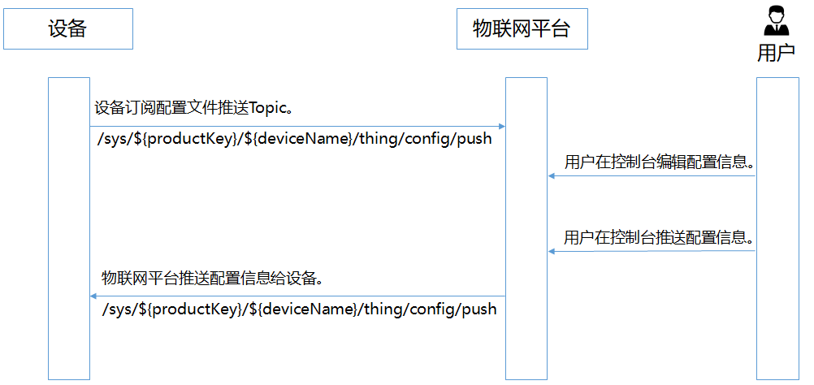
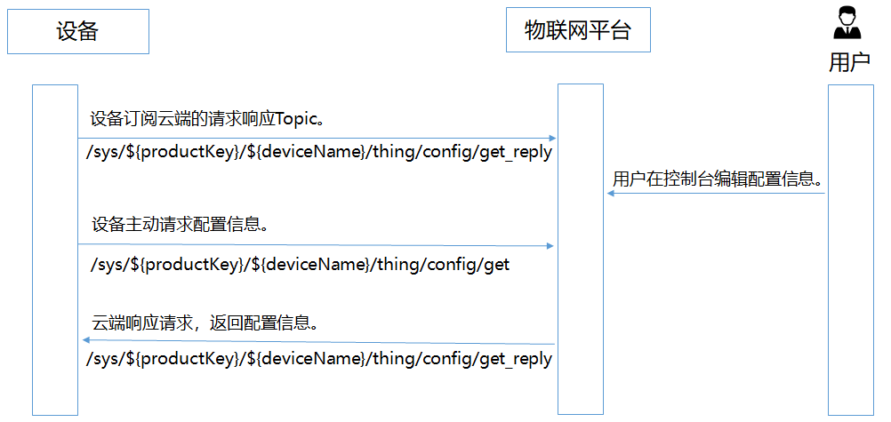

# 远程配置管理

通常来说，开发人员会选择通过向设备推送更新包的方式来进行设备配置信息（包括系统参数、网络参数，以及本地策略等）的更新。然而，这种方式会增加设备固件版本维护的复杂性，并且需要在设备暂停运行的状态下才能完成更新。

为了解决这些问题，SagooIOT平台提供了一种不必让设备重启或暂停运行即可进行在线更新配置信息的能力，即远程配置更新功能。通过此功能，开发者可以在设备持续运行的情况下，实现对设备系统参数、网络参数等配置信息的在线远程更新。

需要注意的是，这种远程配置功能是从产品角度来进行设备配置的修改，也就是说，从物联网平台上传的配置文件会对全部设备生效，而无法指定对单一设备生效。

## 前提条件

设备端已具备远程配置服务的能力。它表现在两方面：设备主动请求配置信息和物联网平台推送配置信息。以下是相关主题（Topic）以及数据格式的详情：

1. **设备主动请求配置信息**
   设备通过特定的Topic主动发送请求，获取其最新的配置信息。这通常在设备启动或刷新配置时发生。

2. **物联网平台推送配置信息**
   SagooIOT平台可以通过特定的Topic向设备推送新的配置信息，设备收到信息后与本地的配置进行比较，如果有差异，则按照平台推送的新配置信息进行更新。

   

## 功能说明
物联网平台远程配置功能支持：
* 启用或禁用针对产品的远程配置功能。
* 实时在线编辑配置文件，同时也能进行版本控制管理。
* 通过物联网平台，能批量推送配置文件，实现设备配置信息的大范围更新。
* 设备主动发起更新配置信息的请求。


## 应用场景

远程配置功能的应用可被划分为两大场景：

* 物联网平台向设备主动推送配置信息：在物联网平台的控制台，您可以选择针对多个设备进行配置信息的批量推送。收到信息的设备将对其本地的配置文件进行相应的修改。
* 设备侧对配置信息的主动请求：设备可主动向物联网平台请求最新的配置文件，并按照获取的新配置进行更新。


### 场景一：物联网平台推送配置信息给设备端

在物联网平台控制台，向某一产品下的所有设备批量推送配置文件。


1. 设备上线。

   需配置设备端订阅推送配置信息的Topic：`/sys/${productKey}/${deviceKey}/thing/config/push`。

2. 在SagooIOT平台中，编辑配置文件。

   1. 登录系统。

   2. 在远程配置功能中找到相应的产品。

   3. 选择产品，打开远程配置开关，单击**编辑**。

   4. 在**配置模板**下的编辑区，编写或粘贴JSON格式的配置信息。

      **说明**

      产品配置模板适用于该产品下的所有设备。目前，不支持在物联网平台向单个设备推送配置文件。

   5. 编辑完成配置信息后，单击**保存**，然后单击**确认**。

      完成保存后，您可手动将配置信息批量更新到该产品下的所有设备，设备可主动请求更新该配置信息。

3. 单击**批量更新**，然后单击**确认更新**。

   完成确认后，物联网平台会向该产品下的所有设备批量推送配置文件。

   您单击**批量更新**后，如果物联网平台判断不是可信环境，会发起短信验证。当您完成短信验证后，物联网平台才会向设备下发配置文件。

   **重要**

   - 从本次推送成功开始计时，同一产品下，1小时内不支持再次推送新的配置文件。
   - 同一产品的同一配置文件，仅支持从物联网平台推送一次。即使后续重复本操作，也无法再次推送相同的配置文件。
   - 如需停止批量更新设备配置信息，请关闭该产品的远程配置开关。关闭远程配置后，物联网平台将停止所有更新推送，并且拒绝设备的主动更新请求。

4. 设备端接收物联网平台下发的配置文件下载链接后，自行更新配置。

   **说明**

   物联网平台下发的配置文件下载链接有效期为30分钟，设备端需要及时下载。

5. （可选）查看和管理配置文件版本。

   远程配置默认保存最近5次的修改记录。如果重新编辑并提交配置文件成功，上一版的配置信息将显示在下方的配置版本记录列表中。

   您可查看版本更新时间和配置内容，方便追溯。单击目标版本的**查看**，在弹出对话框中，查看该版本的配置内容。您可在对话框中，单击**恢复至此版本**，所选版本的内容会恢复至编辑区中。您可在编辑区修改内容，进行批量更新。

### 场景二：设备主动请求配置信息

设备主动查询并更新配置信息流程图如下。

1. 设备上线。

   开发设备端时，已配置设备端订阅物联网平台响应设备请求配置信息的Topic：`/sys/${productKey}/${deviceKey}/thing/config/get_reply`。

2. 开启远程配置，编辑配置信息，请参见[场景一]步骤2。

3. 设备端使用接口linkkit_invoke_cota_get_config来触发远程配置请求。

4. 设备通过Topic`/sys/${productKey}/${deviceKey}/thing/config/get`主动查询最新的配置信息。

5. 接收到设备的请求后，物联网平台会返回最新的配置信息到Topic：`/sys/${productKey}/${deviceKey}/thing/config/get_reply`。

6. 设备端使用下发的配置文件链接，自行下载配置文件。

   

   **说明**

   物联网平台下发的配置文件下载链接有效期为30分钟，设备端需要及时下载。


## 基于mqtt协议的远程配置

本文档介绍设备主动请求配置信息和物联网平台推送配置信息的Topic及数据格式。

### 设备主动请求

**上行**

* 请求Topic：/sys/${productKey}/${deviceKey}/thing/config/get
* 响应Topic：/sys/${productKey}/${deviceKey}/thing/config/get_reply

**请求数据格式**

```json
{
  "id": 123,
  "version": "1.0",
  "sys":{
      "ack":0
  },
  "params": {
    "configScope": "product",
    "getType": "file"
  },
  "method": "thing.config.get"
}
```
**响应数据格式**

```json
{
  "id": "123",
  "version": "1.0",
  "code": 200,
  "data": {
    "configId": "123dagdah",
    "configSize": 1234565,
    "sign": "123214adfadgadg",
    "signMethod": "Sha256",
    "url": "XXXXXX文件地址",
    "getType": "file"
  }
}
```
**参数说明**

| 参数              | 类型    | 说明                                                         |
| :---------------- | :------ | :----------------------------------------------------------- |
| id                | String  | 消息ID号。String类型的数字，取值范围0~4294967295，且每个消息ID在当前设备中具有唯一性。 |
| **version**     | String  | 协议版本号，目前协议版本号唯一取值为1.0。                    |
| **sys**         | Object  | 扩展功能的参数，其下包含各功能字段。**说明** 使用设备端SDK开发时，如果未设置扩展功能，则无此参数，相关功能保持默认配置。 |
| **ack**        | Integer | `**sys**`下的扩展功能字段，表示是否返回响应数据。1：云端返回响应数据。0：云端不返回响应数据。**重要** 如果未配置该功能，则无此参数，云端默认返回响应数据。 |
| **configScope** | String  | 配置范围， 目前只支持产品维度配置。 取值：product。          |
| **getType**     | String  | 获取配置类型。 目前支持文件类型，取值：file。                |
| **method**      | String  | 请求方法，取值：thing.config.get。                           |
| **configId**    | String  | 配置文件的ID。                                               |
| **configSize**  | Long    | 配置文件大小，按字节计算。                                   |
| **sign**        | String  | 签名。                                                       |
| **signMethod**  | String  | 签名方法，仅支持Sha256。                                     |
| **url**         | String  | 存储配置文件的对象存储（OSS）地址。                          |
| **code**        | Integer | 结果码。返回200表示成功，返回其他状态码，表示失败。          |

**错误码**

| 错误码 | 消息                                   | 描述                                                         |
| :----- | :------------------------------------- | :----------------------------------------------------------- |
| 6713   | thing config function is not available | 产品的远程配置功能不可用，需要在[物联网平台控制台](http://iot.console.aliyun.com/)，对应实例的监控运维 > 远程配置打开配置开关。 |
| 6710   | no data                                | 没有配置的数据。                                             |

### 配置推送

**下行**

- 请求Topic：`/sys/${productKey}/${deviceName}/thing/config/push`
- 响应Topic：`/sys/${productKey}/${deviceName}/thing/config/push_reply`

设备订阅该Topic后，您在物联网控制台批量推送配置信息时，物联网平台采用异步推送方式向设备推送信息。

**请求数据格式：**

```json
{
  "id": "123",
  "version": "1.0",
  "params": {
    "configId": "123dagdah",
    "configSize": 1234565,
    "sign": "123214adfadgadg",
    "signMethod": "Sha256",
    "url": "XXXXXX文件地址",
    "getType": "file"
  },
  "method": "thing.config.push"
}
```

**响应数据格式**

```json
{
  "id": "123",
  "code": 200,
  "data": {}
}
```

**参数说明：**

| 参数              | 类型    | 说明                                                         |
| :---------------- | :------ | :----------------------------------------------------------- |
| **id**          | String  | 消息ID号。String类型的数字，取值范围0~4294967295，且每个消息ID在当前设备中具有唯一性 |
| **version**     | String  | 协议版本号，目前协议版本号唯一取值为1.0。                    |
| **configScope** | String  | 配置范围， 目前只支持产品维度配置。 取值：product。          |
| **getType**     | String  | 获取配置类型，目前支持文件类型，取值：file。                 |
| **configId**    | String  | 配置的ID。                                                   |
| **configSize**  | Long    | 配置大小，按字节计算。                                       |
| **sign**        | String  | 签名。                                                       |
| **signMethod**  | String  | 签名方法，仅支持sha256。                                     |
| **url**         | String  | 存储配置文件的对象存储（OSS）地址。                          |
| **method**      | String  | 请求方法，取值：thing.config.push。                          |
| **code**        | Integer | 结果信息， 具体请参见设备端通用code                          |


### 设备端通用code

设备通用code信息，用于表达云端下行推送时设备侧业务处理的返回结果。

| 错误码        | 消息                    | 描述                                                         |
| :------------ | :---------------------- | :----------------------------------------------------------- |
| 200           | success                 | 请求成功。                                                   |
| 400           | request error           | 内部服务错误， 处理时发生内部错误                            |
| 460           | request parameter error | 请求参数错误， 设备入参校验失败                              |
| 429           | too many requests       | 请求过于频繁，设备端处理不过来时可以使用                     |
| 100000-110000 | 自定义的错误信息        | 从100000到110000的错误码用于设备自定义错误信息，和云端错误信息加以区分 |
