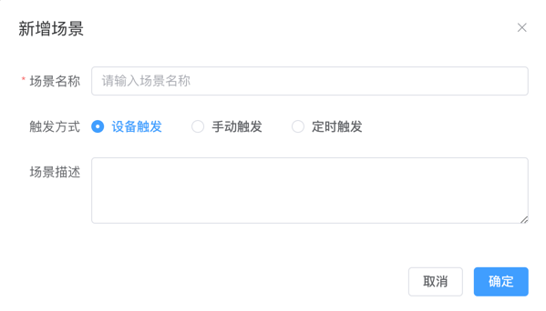
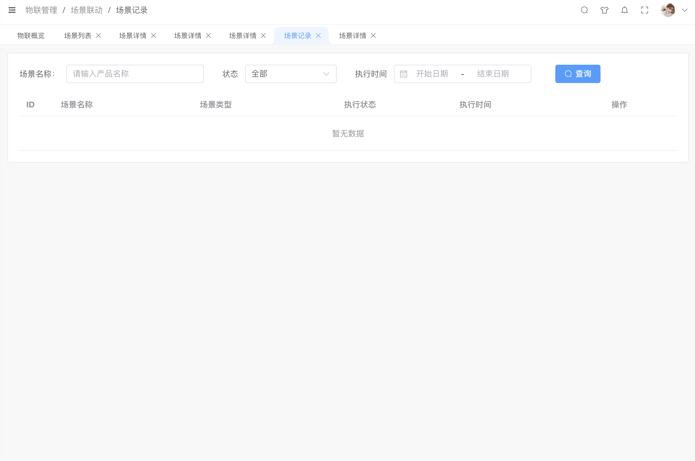

# 管理场景

场景是基于多维度数据的规则，用于判断实际业务中的异常情况。例如，产线异常场景可以结合温度、震动、噪声及转速数据，判断是否需要工程师介入检查维修。当场景规则触发后，可以通知相应的异常到指定的联系人或联系人组，联系人收到通知后可以及时采取措施，避免异常造成进一步损失。
或是，当场景规则触发后，可以触发相应的动作，例如，触发工单，触发告警，触发流程等。

## 场景运行原理
在场景联动服务中，场景规则按照以下模式运行：
* 触发事件
场景规则的触发事件可以是设备上下线变更、物模型属性上报、定时事件或自定义API事件。例如，在产线监控场景中，可以使用设备噪声大于120分贝作为触发事件。
* 检查条件
当场景事件被触发后，系统会检查是否满足某些条件。例如，在产线监控场景中，可以检查设备转速是否低于30转每秒且设备水温大于80℃。
* 执行动作
当触发事件和检查条件都满足时，系统会执行场景规则中定义的动作。例如，在产线监控场景中，可以发送通知给运维人员，提醒他们检查设备。

可通过配置场景定义和场景动作，对设备状态变更和属性数据上报进行通知及联动。支持手动、定时、设备输出三种场景模式，支持设备到设备、支持设备到业务等联动需求。

## 新增场景

点击"新增场景”按钮，打开“新增场景”弹窗。可对场景名称、触发方式、场景描述进行新增。

| 参数名称 | 描述                                                         |
| -------- | ------------------------------------------------------------ |
| 场景名称 | 必填输入框，是对场景名称进行定义。                           |
| 触发方式 | 必选单选，是对触发方式进行定义。 设备触发：设备触发是指在特定设备发生事件或属性变化时，关联的设备执行预先指定的动作。 手动触发：手动触发是指平台通过下发指令，远程控制设备完成预设动作。 定时触发：定时触发是指按照预定的时间计划，向设备下发指令以执行规定的动作。支持使用Corn表达式方式配置触发频率，提供更灵活的定时控制。 |
| 场景描述 | 非必填输入框，是对场景描述进行定义。                         |

## 场景编辑

点击"编辑”按钮，打开“编辑场景”弹窗。可对场景名称、触发方式、场景描述进行修改。

## 配置触发规则

触发规则步骤 选择产品->选择设备->选择触发类型

| 参数名称 | 描述                                                         |
| -------- | ------------------------------------------------------------ |
| 选择产品 | 可选择产品页面展示当前账号数据权限范围内的所有产品。         |
| 选择设备 | 根据选择的产品，对设备进行选择。                             |
| 触发类型 | 最后对触发类型进行定义，可选择根据产品物模型提供可配置的功能权限，包括设备上线、设备离线、读取属性、修改属性、属性上报、功能调用、事件上报。 |

## 配置触发条件

| 参数名称   | 描述                                                         |
| ---------- | ------------------------------------------------------------ |
| 请选择参数 | 必填，是对参数进行定义。                                     |
| 操作符     | 必填，未选择参数时，下拉为空；根据参数的数据类型显示对应的操作符。 |
| 参数值     | 必填输入框，根据参数数据类型输入对应参数值。                 |

## 配置场景动作

| 参数名称 | 描述                                                         |
| -------- | ------------------------------------------------------------ |
| 串行动作 | 首先，在选择产品后，根据产品选定相应的设备。随后，对触发类型进行定义，包括设备上线、设备离线、读取属性、修改属性、属性上报、事件上报以及功能调用。 |
| 并行动作 | 根据选择的触发类型，明确相应的触发条件，并输入相关的参数、操作符以及参数值。 |

## 配置动作类型

| 参数名称           | 描述                                                         |
| ------------------ | ------------------------------------------------------------ |
| 设备输出           | 用于配置设备功能调用、获取属性、设置属性。                   |
| 发送通知           | 用于配置发送通知，包含钉钉、微信、邮件等通知方式。           |
| 调用WEB服务        | 用于定义调用WEB服务，包含请求的方式、编码、服务地址、设置请求头、参数编写。 |
| 触发告警           | 用于定义触发告警，包括告警级别、告警信息填写。               |
| 延迟执行           | 用于定义延迟执行时间。                                       |
| 触发场景自定义事件 | 用于自定义场景，进行场景联动设置。                           |

## 场景记录

您可以查看该场景运行的日志。

