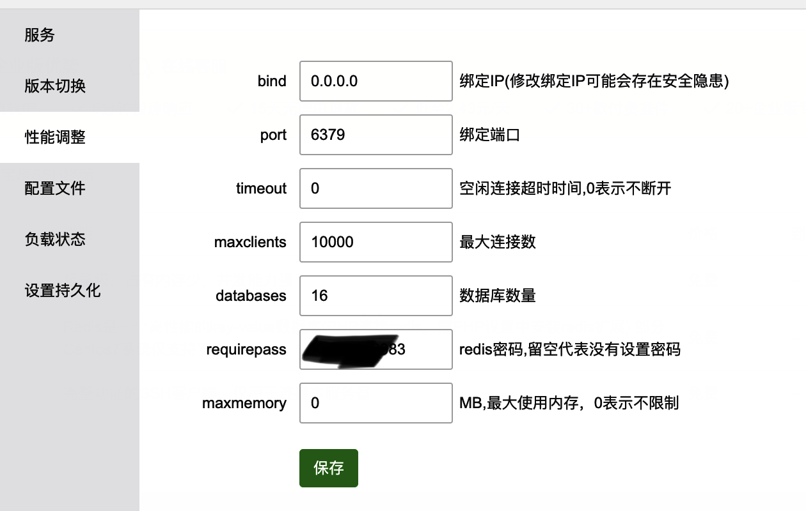
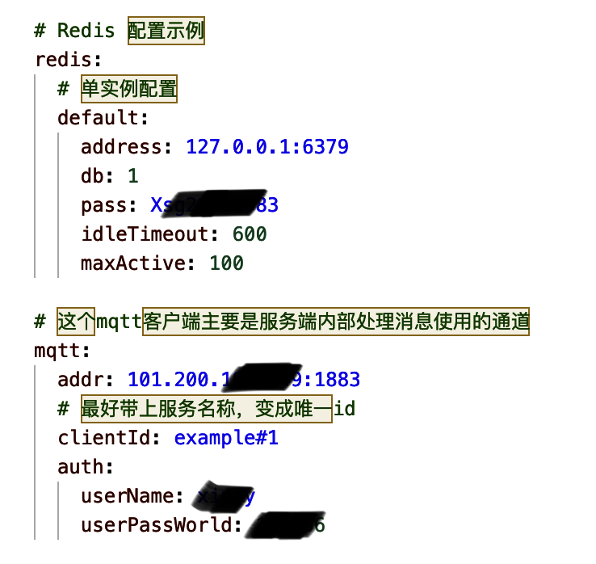
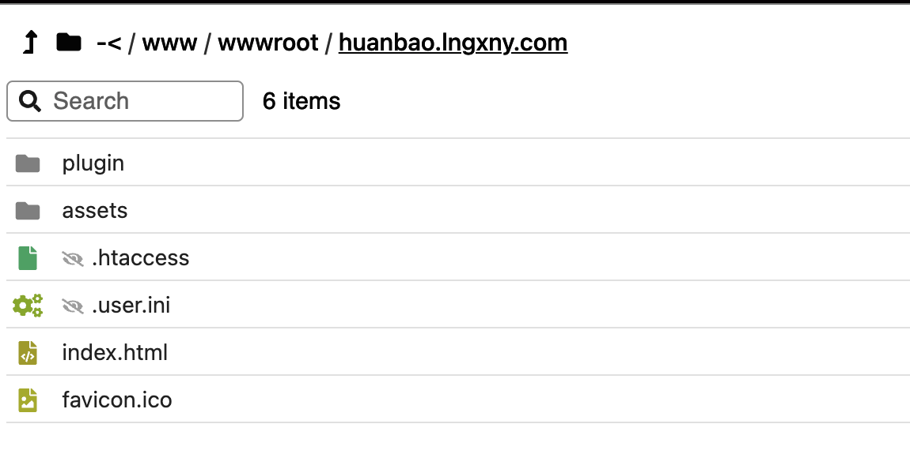

# 详细安装过程

## 基础环境安装

1. Redis 7.0.4
2. TDengine 3.0.1.5 【[安装文档](https://docs.taosdata.com/get-started/package/)】
3. EMQX 5.0.9-el8
4. Nginx 1.22.0
5. rule-engine

### 1. 安装redis

1. 安装目录: `/www/service/redis`

2. 修改配置文件

   

    3. 启动redis

       使用宝塔进行启动或者进入到src目录下使用./redis-server进行启动

### 2. 安装TDengine

1. 官网地址:` https://www.taosdata.com/`

2. 下载安装包到服务器`/opt/TDengine`目录下

   

3. 使用tar -zxf解压压缩包

4. 进入到TDengine-server-3.0.1.5目录里使用命令`sudo ./install.sh`进行安装

5. 使用`systemctl start taos`启动

6. 使用`systemctl status taosd`查看TD是否启动成功

   

7. 使用命令taos进入命令窗口

8. 使用`alter user root pass '密码';`对root用户设置权限，也可使用create user创建用户

9. 系统使用http形式连接，故需`systemctl start taosadapter`启动taosadapter

### 3. 安装EMQX

1. 官网地址:` https://www.emqx.com/zh`

2. `wget https://www.emqx.com/zh/downloads/broker/5.0.9/emqx-5.0.9-el8-amd64.tar.gz `下载对应版本的emqx到/opt目录下

3. 在/opt/目录下通过`mkdir -p emqx && tar -zxvf emqx-5.0.9-el8-amd64.tar.gz -C emqx`解压

4. 使用`./emqx/bin/emqx start `命令进行启动

5. `http://localhost:18083/ `登录此地址查询是否安装成功，默认账号: admin 密码: public

6. 设置权限认证

   

### 4.  安装Nginx

1. 安装目录` /www/server/nginx`(通过宝塔进行安装)
2. 使用宝塔启动方式进行启动

1. 部署应用服务

    1. 更改config.yaml配置

       

       

    2. 使用`./build.sh linux`进行打包

    3. 将编译后的文件上传至服务器

       目录为: `/home/sagoo-admin`

    4. 进入到sagoo-admin目录下，使用`./curl.sh start`启动

### 5.  rule-engine

**服务器(cent os)安装nodejs 最新版**

1. `yum list nodejs` 查看是否为最新版本
2. 如果不是，通过下面代码增加源信息 `curl --silent --location https://rpm.nodesource.com/setup_18.x | sudo bash`
3. 然后在 `yun install nodejs`

**如果安装包过慢，可以先设置淘宝源  `npm config set registry https://registry.npm.taobao.org/`**

1. 全局安装 pm2 `sudo npm i pm2 -g`
2. 将【rule-engine】项目拷贝到服务器上
3. 在【rule-engine】目录下安装包依赖 `npm install`
4. 启动项目 `pm2 start packages/node_modules/node-red/red.js --name rule-engine:1880`  之后可以通过 `pm2 show rule-engine:1880` 查看项目运行情况
5. 按照【rule-engine】项目下 `nginx/node-red.conf` 文件的配置增加一下nginx配置，来保证规则引擎和iot的同源


## SagooIOT安装

### 服务端安装

通过源码进行编译安装

#### build.sh编译脚本

可以使用build.sh进行程序编译，如果在使用build.sh脚本进行程序编译时，提示

```
fatal: No names found, cannot describe anything.
./build.sh linux|windows|mac

```
是因为源码没有进行git版本的标签设置。

支持将git的tag编译到程序中。需要创建git的tag。只有创建了tag，编译的程序才会显示版本号。

```
git tag v0.0.1

git push origin v0.0.1
```

编译后，将bin目录下生成的全部文件放到需要部署的文件目录即可。

#### 编译后执行脚本

编译后生成的可执行文件放在bin目录下，将bin目录下的文件放到目标服务器，执行`./curl.sh start` 运行即可。

```
curl.sh脚本参数：

start|stop|restart|status|tail

```

分别对应 启动、停止、重启、状态、显示动态日志运行信息

####  插件编译

如果要使用插件，需要提前将插件进行编译。直接使用plugins下面的编译脚本直接执行就可以。


#### 其它问题

**如果在macOS下遇到 Warning :`IOMasterPort`：**

```
warning: ‘IOMasterPort‘ is deprecated: first deprecated in macOS 12.0 [-Wdeprecated-declarations]
```
**原因**

依赖包跟MacOS的版本有兼容问题。

解决方案
切换CGO编译方式
```
go env -w CGO_ENABLED="0"
```

 **如果采用HTTPS方式时SSE不工作，需要如下配置：**

```Nginx
    proxy_set_header Connection '';
    proxy_http_version 1.1;
    chunked_transfer_encoding off; 
```


### 前端部署

1. 点击build打包构建

   

2. 将打包后的文件上传至服务器`/www/wwwroot/huanbao.lngxny.com`目录下即可

   
