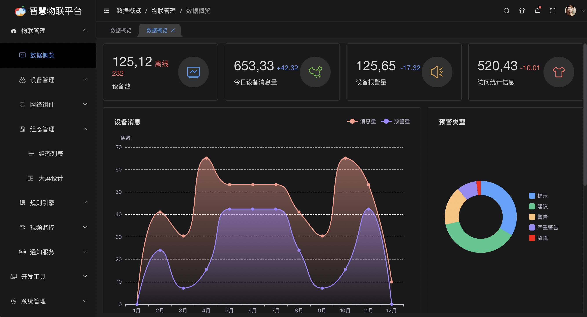

# 系统介绍
SagooIOT是一个开源的企业级物联网平台系统,它实现了物联网平台所需的核心功能,可以帮助企业快速构建个性化的物联网系统。SagooIOT支持各类传感器、执行器、网关等设备的接入,实现数据采集、远程控制、数据分析、智能联动等功能。并开放平台API接口、北向接口与第三方系统对接。
[更多介绍...](/guide/base/introduce)

## 适合用户

* 快速交付项目
* 快速开发自己的方案
* 设备物联网 + 业务

## 可用领域

SagooIOT 可广泛用于开发**电力、环保、供热、交通、医疗、消防、安防、工业、农业**等各个领域的物联网应用方案。

## 系统介面

## 名词解释

| 名词         | 解释                                                         |
| :----------- | ------------------------------------------------------------ |
| 直连设备     | 设备本身具备联网能力，能够不通过网关直接连接到物联网平台。   |
| 网关设备     | 能够直接连接物联网平台的设备，且具有子设备管理功能，能够代理子设备连接云端。 |
| 子设备       | 本质上也是设备。子设备不能直接连接物联网平台，只能通过网关连接。 |
| 设备凭证     | 设备接入平台准入校验是通过设备访问令牌进行校验，校验通过后，设备数据会直接上报到该设备。 |
| 标签         | 通常根据设备的特性为设备添加的特有标记，您可以自定义标签内容。 |
| Topic        | Topic是UTF-8字符串，是发布（Pub）/订阅（Sub）消息的传输中介。可以向Topic发布或者订阅消息。 |
| 发布         | 操作Topic的权限类型，对应的英文名称为Pub。可以往此类Topic中发布消息。 |
| 订阅         | 操作Topic的权限类型，对应的英文名称为Sub。可以从此类Topic中订阅消息。 |
| 设备配置     | 某一类设备的通用配置，包括Topic、规则链、消息处理队列、传输配置等。 |
| 规则引擎     | 通过创建、配置规则，以实现数据流转、转换脚本和场景联动。     |
| 数据解析脚本 | 针对不同设备收发需要的异构数据格式，需要在云端编写数据解析脚本，将设备上报的二进制数据或自定义的JSON数据，转换为物联网平台支持的JSON数据格式；将平台下发的JSON格式数据，转换为设备支持的格式。 |
