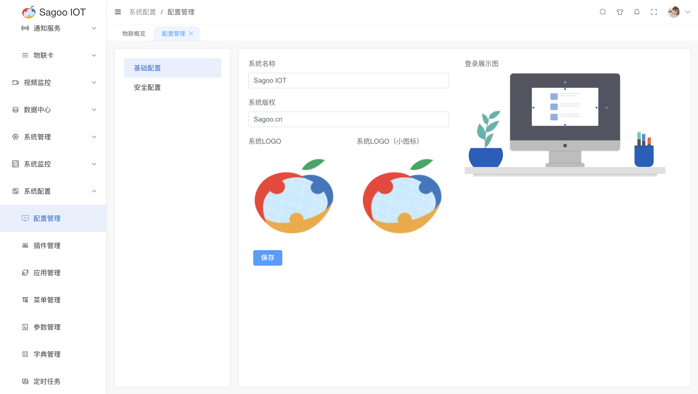
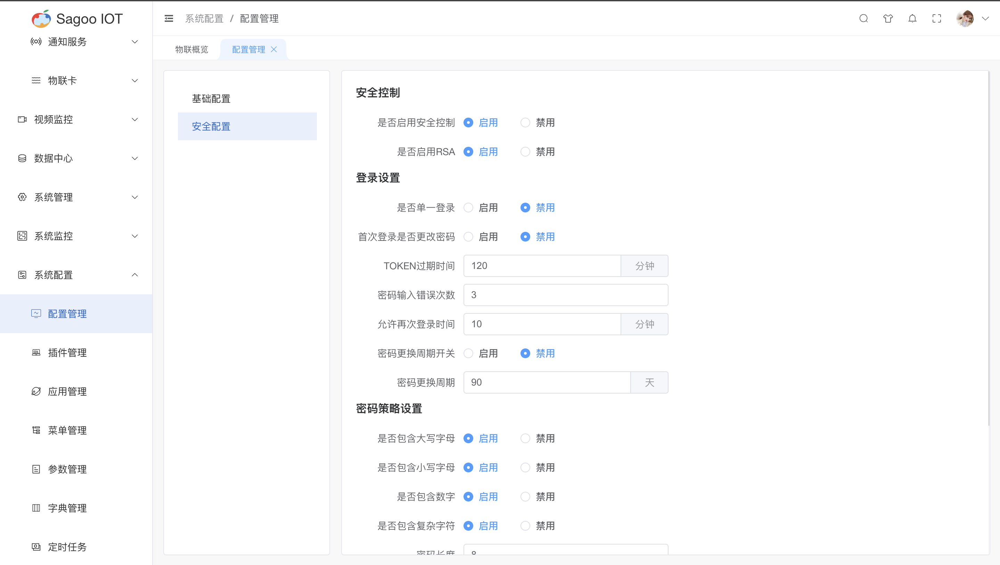

# 配置管理

配置管理是SagooIoT系统的基础的系统配置。这些配置项包括系统基础配置、安全策略等方面的配置。

## 基础配置

1. 请确保已登录SagooIOT物联网平台。

2. 在左侧导航栏中，选择系统配置->配置管理->基础配置

3. 基础配置说明
* 对系统的基础配置可进行调整，其中包含系统名称、系统版权、系统LOGO（系统LOGO小图标）、登录展示图
  

| 填写项       | 说明             | 备注               |
|-----------|----------------|------------------|
| 系统名称      | 显示在登录页的名称      |                  |
| 系统版权      |                |                  |
| 登录展示图     | 登录页面显示的大图      | 图片大小建议 300x150px |
| 系统LOGO    | 登录页面显示的LOGO图   | 图片大小建议50x50px        |
| 系统LOGO（小） | 登录后左上角显示的小logo | 图片大小建议32x32px        |

图片格式推荐使用svg透明背景的图片

:::tip 提示
如果遇到图片无法正常显示，请检查系统参数的配置。位置在：系统配置--》参数管理--》文件

上传文件方式及本地上传api域名配置。如果采用了nginx进行了路由，请注意base-api的配置。

:::

## 安全配置

1. 请确保已登录SagooIOT物联网平台。

2. 在左侧导航栏中，选择系统配置->配置管理->安全配置

3. 安全配置说明
* 对系统的安全配置可进行调整，其中包含安全控制、登录设置、密码策略设置、权限设置。
  
