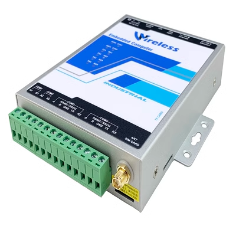

# 设备本地端接入网关

## **一、主要功能**

- **边缘侧协议转换：**
  - 在设备侧既可完成协议转换和数据解析，更加实时高效，减轻远程平台的通信压力；支持标准通信协议，如ModbusRTU、ModbusTCP、DLT645-1997/07、CJ/T188、西门子PLC、BACNet、IEC104、OPCUA等，同时支持通过Lua脚本可实现非标协议通信，简单高效；

- **边缘侧数据采集：**

	- 在设备测即可完成轮询采集设备数据，同时将设备数据转换成标准、统一JSON格式，不仅减轻远程平台的轮询采集压力，而且减轻远程平台数据转换压力，远程平台只需专注于应用；内置公式计算引擎，支持将设备数据进行运算，减轻远程平台运算压力；

- **多协议、多通道上报：**

	- 支持多种协议上报（MQTT、HTTP、自定义TCP/UDP等），支持同一时刻上报数据到不同的平台；支持定时上报和变化上报，即保证设备数据的实时性，又降低了流量消耗；支持远程平台命令下发，接收命令后进行解析和验证，在转发给设备；

- **边缘侧场景联动：**

	- 在设备测即可完成多种设备的联动控制，无需将设备数据上传至远程平台，联动控制速度更快、更稳定；

- **远程维护、远程升级：**

	- 内置Webserver，通过浏览器即可完成各项功能配置，上手简单、使用方便，减少运维成本，提高产品使用体验；

## 1.1、支持采集协议

| 接口类型 | 协议名称 |
| --- | --- |
| 串口 | ModbusRTU |
|  | CJT188 |
|  | DLT645-1997 |
|  | DLT645-2007 |
|  | DLT698.45-2017 |
| 开关量输入\输出 | 通过系统文件接口读写 |
| 模拟量输入\输出 | 通过系统文件接口读写 |
| 网口 | ModbusTCP |
|  | ModbusRTUOverTCP |
|  | 西门子PLC Snap7协议 |
|  | BACNet IP |
|  | IEC104 |
|  | OPCUA |
|  | HTTP客户端 |
|  | PING |

非标协议：通过脚本实现非标或自定义协议转换

## 1.2、支持转发协议

以下是图中内容的文字描述：

网关支持的转发协议为：mqtt，http，tcp，Modbus

## 二、技术参数

- 技术参数
  供电电压：DC 9V～36V
  以太网接口：1路高性能100M/10M自适应工业网卡,支持AUTO MDI/MDIX；
  RS485接口：1路电气隔离RS485接口，采用三级防雷防静电设计，支持4KV雷击防护；
  4G通信接口(选配)**：**内部集成工业级Cat1 4G全网通模块 LTE-FDD：最大下行速率10Mbps，最大上行速率5Mbps；
  RTC时钟**：**内部集成实时时， 板载RTC备份电池断电后可以运行3年以上；
  尺寸：99*96*27mm(长*宽*高)
  工作环境**：**-40～85℃（温度）、20％～90％无凝露（湿度）

