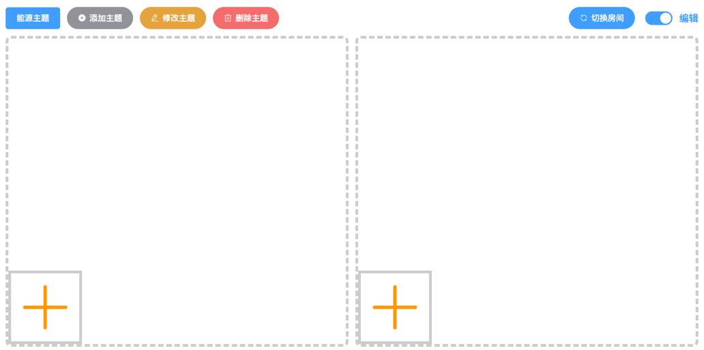

# 大屏展示控制管理
LscServer大屏远程协同控制服务
这是一个基于浏览器的大屏展示系统。大屏展示过程中，经常有演示讲解的需求。这个时候有一个灵活，有序的协同控制系统将会方便演示者随时调换大屏页面进行演示。这个服务只是一个软分屏处理的模式。支持主题整屏切换，支持内分屏子屏切换。

自适应PAD展示。

windows版环境要求：64位操作系统，win7以上版本

浏览器要求：建议使用：Chrome

注：需要在命令行执行。

大屏端显示：http://127.0.0.1:8199/view

控制端显示：http://127.0.0.1:8199




## 备注：

控制页可以填加任何通过浏览器访问的内容。对于需要登录的页面，需要自行登录。可以通过浏览器的记录密码的功能，保留登录密码。

由于前端无法跨域进行页面内容处理，所以无法实现第三方页面的自动登录。

如果遇到访问大屏页cookies报错，请将Chrome浏览器的cookies跨域的设置关掉

```
chrome://flags/#same-site-by-default-cookies
  
chrome://flags/#cookies-without-same-site-must-be-secure
 
 ```

