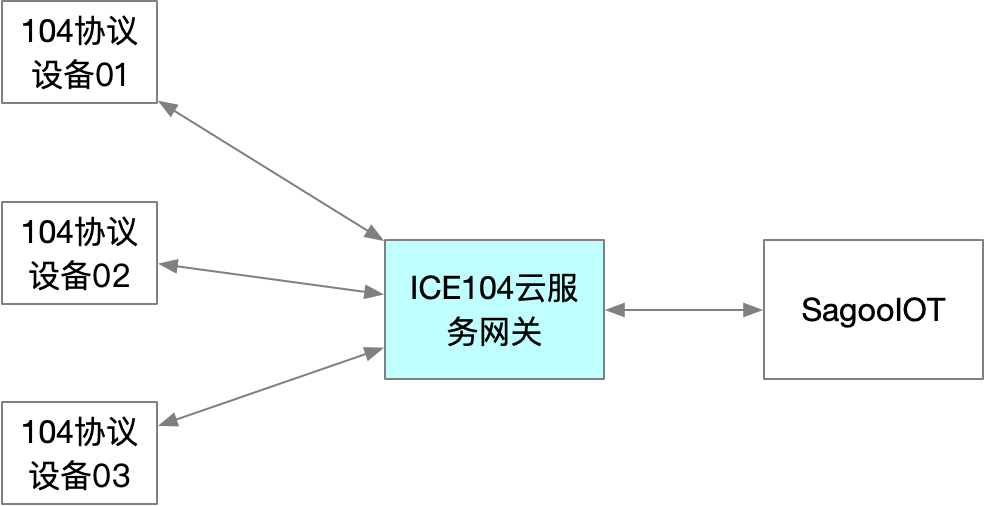

# 服务说明
提供TCP Server 端口，设备侧主动通过TCP Client向平台指定端口发起连接，进行数据采集服务。

**功能说明：**

* 支持点表配置
* 支持日志输出
* 支持设备定时任务配置（总召唤，电度召唤，校时）
* 支持遥控和遥调
* 支持104超时应答和序列号检验开关配置，默认不校验，不发送心跳测试报文
* 支持19种常用上行数据类型

## 104功能列表

|                          |                       |      |                     |          |
| ------------------------ | --------------------- | ---- | ------------------- | -------- |
| 消息流                   | 终端 TCP 客户端       | 方向 | 平台 TCP 服务端     | 定时调度 |
| 设备信息上报             | 上报设备mac地址       | →    |                     |          |
|                          |                       |      |                     |          |
| 首次握手(U帧)            |                       | ←    | 激活传输启动        |          |
|                          | 确认激活传输启动      | →    |                     |          |
|                          |                       |      |                     |          |
| 总召唤（模拟量、开关量） |                       | ←    | 总召唤              | ✔        |
|                          | 总召唤激活 100        | →    |                     |          |
|                          | YX帧(遥信)            | →    |                     |          |
|                          | YC帧(遥测)            | →    |                     |          |
|                          | 总召唤结束 100        | →    |                     |          |
|                          |                       |      |                     |          |
| 校时（时钟同步）         |                       | ←    | 设置 67（类型标识） | ✔        |
|                          | 应答 67（类型标识）   | →    |                     |          |
|                          |                       |      |                     |          |
| 电度总召唤(可选)         |                       | ←    | 召唤电度            | ✔        |
|                          | 召唤电度激活          | →    |                     |          |
|                          | 电度数据上报          | →    |                     |          |
|                          | 召唤电度结束          | →    |                     |          |
|                          |                       |      |                     |          |
| 突变上送，遥测，遥信     | 主动上送突变遥信      | →    |                     |          |
|                          | 主动上送突变SOC，遥测 | →    |                     |          |
|                          |                       |      |                     |          |
| 测试（双向）             | 心跳                  | ↔    | 心跳应答            |          |
|                          | 心跳应答              | ↔    | 心跳                |          |
|                          |                       |      |                     |          |
| 指令下发-遥控            |                       | ←    | 发送遥控预置        |          |
|                          | 确认                  | →    |                     |          |
|                          |                       | ←    | 发送遥控执行指令    |          |
|                          | 执行确认              | →    |                     |          |
|                          |                       | ←    | 发送遥控撤销        |          |
|                          | 撤销确认              | →    |                     |          |
|                          |                       |      |                     |          |
|                          |                       | ←    | 发送遥调执行指令    |          |
|                          | 执行确认              | →    |                     |          |
|                          |                       |      |                     |          |

## 支持的104上行数据类型

- M_SP_NA_1 // 1: single-point information, 单点信息
- M_SP_TA_1 // 2: single-point information with time tag, 单点信息-带时标
- M_SP_TB_1 // 30: single-point information with time tag CP56Time2a, 单点信息-带CP56Time2a
- M_DP_NA_1 // 3: double-point information, 双点信息
- M_DP_TA_1 // 4: double-point information with time tag, 双点信息-带时标
- M_DP_TB_1 // 31: double-point information with time tag CP56Time2a, 双点信息-带CP56Time2a
- M_ME_NA_1 // 9: measured value, normalized value, 测量值，规一化值
- M_ME_TA_1 // 10: measured value, normalized value with time tag, 测量值，规一化值-带时标
- M_ME_TD_1 // 34: measured value, normalized value with time tag CP56Time2a, 测量值,规一化值-带CP56Time2a
- M_ME_ND_1 // 21: measured value, normalized value without quality descriptor, 测量值,不带品质描述词的规一化值
- M_ME_NB_1 // 11: measured value, scaled value, 测量值，标度化值
- M_ME_TB_1 // 12: measured value, scaled value with time tag, 测量值带时标，标度化值-带时标
- M_ME_TE_1 // 35: measured value, scaled value with time tag CP56Time2a, 测量值,标度化值-带CP56Time2a
- M_ME_NC_1 // 13: measured value, short floating point number, 测量值，短浮点数
- M_ME_TC_1 // 14: measured value, short floating point number with time tag, 测量值，短浮数-带时标
- M_ME_TF_1 // 36: measured value, short floating point number with time tag CP56Time2a, 测量值,短浮点数-带CP56Time2a
- M_IT_NA_1 // 15: integrated totals, 累积量
- M_IT_TA_1 // 16: integrated totals with time tag, 累积量带时标
- M_IT_TB_1 // 37: integrated totals with time tag CP56Time2a, 累积值-带CP56Time2a

## 在SagooIOT中使用说明

ICE104云网关与SagooIOT之间的使用关系，如图所示：

[接入与使用详见使用说明](start.md)

