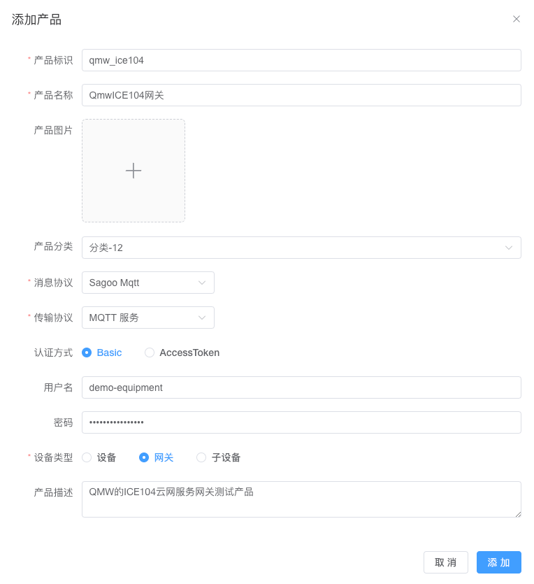

# 使用说明

对于SagooIOT平台来说，ICE104云服务网关，也是看成一种设备，是一种网关设备。

所以使用ICE104云网关的时候，需要在平台的设备管理功能中，添加产品，将ICE104云网关添加到产品。

## 添加网关产品

### 添加产品
进入到添加产品页面，填写产品标识、产品名称、消息协议、传输协议、认证方式、设备类型

设备类型必须选择网关 

### 配置物模型
在产品列表中找到添加的ICE104网关的产品，点详情进入到产品的详情页，进入到物模型的配置标签页中进行物模型配置。

添加一个版本属性，标识为：GatewayVersion，类型为字符型。

然后启用产品。

## 添加104子设备产品
### 添加产品
与上面的添加网关产品方式一样，区别在于设备类型要选择 "子设备"

### 配置物模型

**配置属性**

在这里配置从设备接收的数据项，在属性中一一配置。属性的标识与在104云网关中配置的点表一致。

**配置功能**

在这儿里配置需要向设备触发的动作功能。比如打开开关之类的动作。

配置好属性与功能后，启用产品。

## 添加设备

1，需要在设备管理中分别添加网关设备，添加104子设备。
2，进入到网关设备的详情功能页的子设备标签进行子设备绑定。

后面再增加新的104子设备，只需要在设备管理里面直接添加104子设备就可以，并到网关设备在进行子设备绑定。

